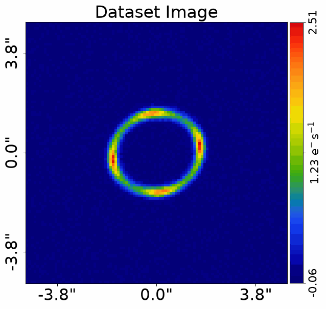
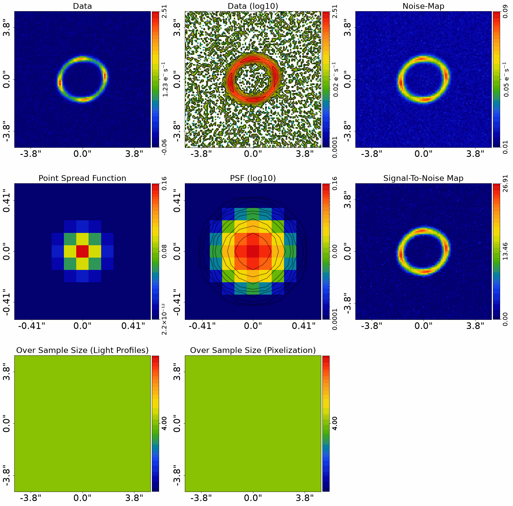
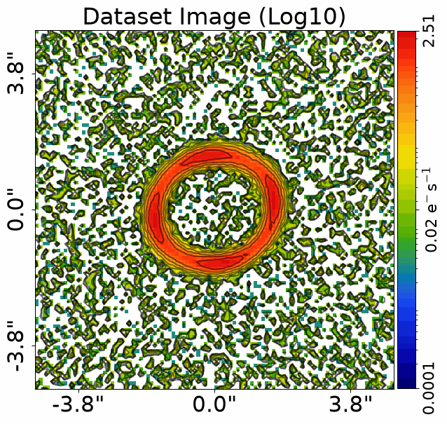
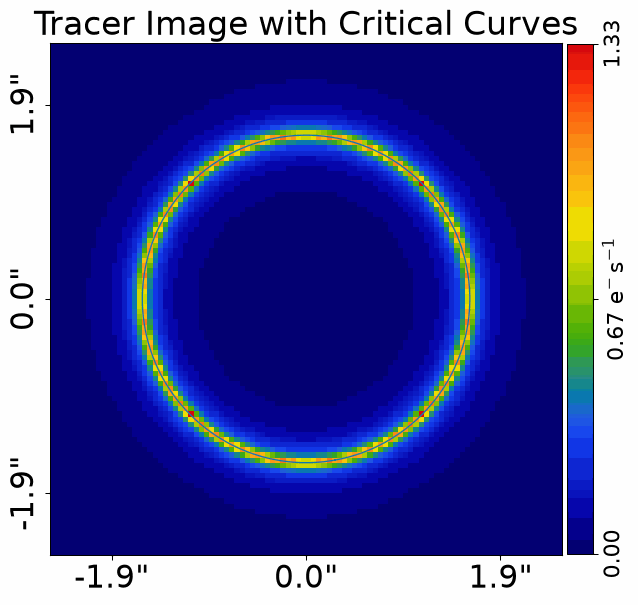

> ✏️ **This page is auto-generated from [`scripts/chapter_1_introduction/tutorial_0_visualization.py`](../../scripts/chapter_1_introduction/tutorial_0_visualization.py) — do not edit it directly.**
> It shows the example fully executed, with its real output images.
> Run it yourself via the [Python script](../../scripts/chapter_1_introduction/tutorial_0_visualization.py) or the [Jupyter notebook](../../notebooks/chapter_1_introduction/tutorial_0_visualization.ipynb).

Tutorial 0: Visualization
=========================

In this tutorial, we quickly cover visualization in **PyAutoLens** and make sure images display
clearly in your Jupyter notebook and on your computer screen.

__Contents__

- **Directories:** **HowToLens** assumes the working directory is the `HowToLens` repository root on your hard-disk.
- **Dataset:** Load and plot the strong lens dataset.
- **Dataset Auto-Simulation:** Create the dataset via its simulator script if it is not on your hard-disk.
- **Subplots:** In addition to plotting individual figures, **PyAutoLens** can plot `subplots` which show multiple.
- **Plot Customization:** Does the figure display correctly on your computer screen?
- **Overlays:** Overlays such as critical curves and image positions are added using the `lines=` and `positions=`.
- **Wrap Up:** Summary of the script and next steps.


```python

from autolens import jax_wrapper  # Sets JAX environment before other imports

from autolens import setup_notebook; setup_notebook()
```

    .../PyAutoNerves/autonerves/workspace.py:206: UserWarning: Cannot verify the workspace at HowToLens/scripts/chapter_1_introduction is compatible with the installed library version (2026.7.23.1): no `version.minimum_library_version` or `version.workspace_version` key in config/general.yaml and no version.txt at the workspace root.
    
    If you cloned the workspace from `main` rather than a release tag, set `version.workspace_version_check: False` in config/general.yaml to silence this warning. The `main` branch updates more frequently than library releases, so version mismatches are expected and not actionable for `main`-branch users.
    
    You can also set the environment variable PYAUTO_SKIP_WORKSPACE_VERSION_CHECK=1 to disable temporarily.
      warnings.warn(_missing_version_warning(root, library_version))
    .../PyAutoNerves/autonerves/workspace.py:206: UserWarning: Cannot verify the workspace at HowToLens/scripts/chapter_1_introduction is compatible with the installed library version (2026.7.23.1): no `version.minimum_library_version` or `version.workspace_version` key in config/general.yaml and no version.txt at the workspace root.
    
    If you cloned the workspace from `main` rather than a release tag, set `version.workspace_version_check: False` in config/general.yaml to silence this warning. The `main` branch updates more frequently than library releases, so version mismatches are expected and not actionable for `main`-branch users.
    
    You can also set the environment variable PYAUTO_SKIP_WORKSPACE_VERSION_CHECK=1 to disable temporarily.
      warnings.warn(_missing_version_warning(root, library_version))
    Working Directory has been set to `HowToLens`
    .../PyAutoNerves/autonerves/workspace.py:206: UserWarning: Cannot verify the workspace at HowToLens/scripts/chapter_1_introduction is compatible with the installed library version (2026.7.23.1): no `version.minimum_library_version` or `version.workspace_version` key in config/general.yaml and no version.txt at the workspace root.
    
    If you cloned the workspace from `main` rather than a release tag, set `version.workspace_version_check: False` in config/general.yaml to silence this warning. The `main` branch updates more frequently than library releases, so version mismatches are expected and not actionable for `main`-branch users.
    
    You can also set the environment variable PYAUTO_SKIP_WORKSPACE_VERSION_CHECK=1 to disable temporarily.
      warnings.warn(_missing_version_warning(root, library_version))


__Directories__

**HowToLens** assumes the working directory is the `HowToLens` repository root on your hard-disk, so that relative
paths to `dataset/` and `output/` resolve correctly.

If your working directory does not match this path on your computer, you can manually set it as follows (the
example below shows the path I would use on my laptop. The code is commented out so you do not use this path in
this tutorial!


```python
# workspace_path = "/Users/Jammy/Code/PyAuto/HowToLens"
# #%cd $workspace_path
# print(f"Working Directory has been set to `{workspace_path}`")
```

__Dataset__

The `dataset_path` specifies where the dataset is located, which is the
directory `dataset/imaging/simple__no_lens_light` of the HowToLens repository.

The simulated images of strong lenses used throughout the **HowToLens** lectures are written to the `dataset`
directory at runtime by the simulator scripts in `scripts/simulator/`.


```python
from pathlib import Path

import autolens as al
import autolens.plot as aplt

dataset_path = Path("dataset") / "imaging" / "simple__no_lens_light"
```

__Dataset Auto-Simulation__

If the dataset does not already exist on your system, it is created by running the corresponding
simulator script. This ensures every example script can be run without manually simulating data first.


```python
if al.util.dataset.should_simulate(str(dataset_path)):
    import subprocess
    import sys

    subprocess.run(
        [sys.executable, "scripts/simulator/no_lens_light.py"],
        check=True,
    )
```

    Figure(700x700)
    .../PyAutoArray/autoarray/operators/convolver.py:1424: UserWarning: No blurring_image provided. Only the direct image will be convolved. This may change the correctness of the PSF convolution.
      warnings.warn(
    Figure(1800x1800)
    Figure(1800x1800)
    Figure(700x700)


We now load this dataset from .fits files and create an instance of an `Imaging` object.


```python
dataset = al.Imaging.from_fits(
    data_path=dataset_path / "data.fits",
    noise_map_path=dataset_path / "noise_map.fits",
    psf_path=dataset_path / "psf.fits",
    pixel_scales=0.1,
)
```

We can plot an image with `aplt.plot_array()`, passing the data array and a title.


```python
aplt.plot_array(array=dataset.data, title="Dataset Image")
```


    

    


__Subplots__

In addition to plotting individual figures, **PyAutoLens** can plot `subplots` which show multiple
views of the dataset at once.

The `aplt.subplot_imaging_dataset()` function plots the data, noise-map and PSF together.


```python
aplt.subplot_imaging_dataset(dataset=dataset)
```


    

    


__Plot Customization__

Does the figure display correctly on your computer screen?

If not, the default matplotlib settings can be customized via the config files in:

  config/visualize/

Key config entries:

 - `mat_wrap.yaml` -> Figure -> figure: -> figsize
 - `mat_wrap.yaml` -> YLabel -> figure: -> fontsize
 - `mat_wrap.yaml` -> XLabel -> figure: -> fontsize
 - `mat_wrap.yaml` -> TickParams -> figure: -> labelsize
 - `mat_wrap.yaml` -> YTicks -> figure: -> labelsize
 - `mat_wrap.yaml` -> XTicks -> figure: -> labelsize

For quick one-off adjustments you can pass `title=`, `colormap=`, and `use_log10=` directly:


```python
aplt.plot_array(array=dataset.data, title="Dataset Image (Log10)", use_log10=True)
```


    

    


__Overlays__

Overlays such as critical curves and image positions are added using the `lines=` and `positions=`
keyword arguments.

For example, we can compute the critical curves of a tracer and overlay them on the image.


```python
grid = al.Grid2D.uniform(shape_native=(100, 100), pixel_scales=0.05)

lens_galaxy = al.Galaxy(
    redshift=0.5,
    mass=al.mp.Isothermal(centre=(0.0, 0.0), einstein_radius=1.6, ell_comps=(0.0, 0.0)),
)

source_galaxy = al.Galaxy(
    redshift=1.0,
    bulge=al.lp.SersicCoreSph(
        centre=(0.0, 0.0), intensity=1.0, effective_radius=0.5, sersic_index=2.0
    ),
)

tracer = al.Tracer(galaxies=[lens_galaxy, source_galaxy])

tangential_critical_curve_list = al.LensCalc.from_tracer(
    tracer=tracer
).tangential_critical_curve_list_from(grid=grid)

aplt.plot_array(
    array=tracer.image_2d_from(grid=grid),
    title="Tracer Image with Critical Curves",
    lines=tangential_critical_curve_list,
)
```


    

    


__Wrap Up__

Throughout the lectures you'll see lots more visuals plotted on figures and subplots.

The key plotting functions you'll use are:

 - `aplt.plot_array(array, title, ...)` — plot any 2D array.
 - `aplt.plot_grid(grid, title, ...)` — plot a 2D grid of coordinates.
 - `aplt.subplot_imaging_dataset(dataset)` — multi-panel dataset overview.
 - `aplt.subplot_tracer(tracer, grid)` — multi-panel tracer overview.
 - `aplt.subplot_fit_imaging(fit)` — multi-panel fit overview.

Great! Hopefully, visualization in **PyAutoLens** is displaying nicely for us to get on with the
**HowToLens** lecture series.
