> ✏️ **This page is auto-generated from [`scripts/chapter_1_introduction/tutorial_2_ray_tracing.py`](../../scripts/chapter_1_introduction/tutorial_2_ray_tracing.py) — do not edit it directly.**
> It shows the example fully executed, with its real output images.
> Run it yourself via the [Python script](../../scripts/chapter_1_introduction/tutorial_2_ray_tracing.py) or the [Jupyter notebook](../../notebooks/chapter_1_introduction/tutorial_2_ray_tracing.ipynb).

Tutorial 2: Ray Tracing
=======================

Strong gravitational lensing occurs when the mass of a foreground galaxy (or galaxies) curves space-time around it,
causing light rays from a background source to appear deflected.

The process of ray tracing calculates how much the path of each light ray is bent by the mass of the foreground galaxy.
It then traces the paths of these light rays back to the observer, allowing us to determine how the source appears
distorted. As a result, the images of the source may appear as arcs, multiple images, or other complex patterns.

In the previous tutorial, we introduced **light profiles**, which are analytic functions that describe the distribution
of light from a galaxy. In this tutorial, we will focus on **mass profiles**, which are analytic functions that
describe the mass distribution within a galaxy. A key quantity derived from these profiles is the **deflection angle**,
which quantifies how light is deflected by the mass of the galaxy at any point in space.

Grids were crucial in the previous tutorial, as they enabled us to compute the light profile of a galaxy at every
coordinate point. In ray tracing, grids are equally important because they are used to calculate the deflection
angles of light rays caused by a mass profile and to map the source's light rays back to the observer.

Let’s revisit the schematic of strong lensing:


As observers, we do not see the true appearance of the source (e.g., a round blob of light). Instead, we only
perceive its light after it has been deflected and lensed by the foreground galaxies. This resulting image is known
as the **observed image** or **image-plane image**, which we will produce through the ray-tracing process.

The schematic above uses the terms "image-plane" and "source-plane." In the context of gravitational lensing, a "plane"
refers to a collection of galaxies located at the same redshift, meaning they are physically aligned parallel to one
another.

In this tutorial, we will create a strong lensing system consisting of planes similar to the one depicted above. While
a plane can contain multiple galaxies, we will focus on a simple scenario with just one lens galaxy and one source
galaxy.

Here is an overview of what we'll cover in this tutorial:

- **Grid**: How the 2D grids that were important for evaluating light profiles are equally important
  for ray-tracing calculations.

- **Mass Profiles**: Introduce mass profiles, which describe the mass distribution of galaxies and are used to
  calculate deflection angles.

- **Ray Tracing Grids**: How to map the light rays from the image-plane to the source-plane using the
 deflection angles and **lens equation**.

- **Ray Tracing Images**: How to evaluate the lensed image of a source galaxy after it has been
  gravitationally lensed.

- **Galaxies**: How to include both light and mass profiles in a single `Galaxy` object, and therefore
construct realistic lens and source galaxies.

- **Tracer**: Introduce the `Tracer` object, which automates the ray-tracing process and allows us to compute
  images of the entire lens system.

- **Mappings**: Visualize how coordinates in the image-plane map to the source-plane by plotting the ray-traced grids.

__Contents__

- **Grid:** In the previous tutorial, we created 2D grids of (y,x) coordinates and showed how shifting and.
- **Mass Profiles:** To perform lensing calculations, we use mass profiles available in the `mass_profile` module.
- **Ray Tracing Grids:** The lens equation uses deflection angles to map image-plane coordinates to the source-plane.
- **Ray Tracing Images:** Evaluating a source's light on the ray-traced grid produces its lensed image.
- **Galaxies:** A `Galaxy` can contain both light and mass profiles, forming realistic lens and source galaxies.
- **Tracer:** The `Tracer` object automates ray-tracing for a system of galaxies at different redshifts.
- **Mappings:** Every image-plane coordinate maps to a source-plane coordinate via the lens equation.


```python

from autolens import jax_wrapper  # Sets JAX environment before other imports

from autolens import setup_notebook; setup_notebook()

import matplotlib.pyplot as plt
import autolens as al
import autoarray as aa
import autolens.plot as aplt

```

    Working Directory has been set to `HowToLens`


__Grid__

In the previous tutorial, we created 2D grids of (y,x) coordinates and showed how shifting and rotating these grids 
is crucial for evaluating the light profiles of galaxies.

Grids are also essential for performing ray-tracing calculations. The coordinates in the grid are deflected by the 
lens galaxy, and these deflected coordinates are used in ray-tracing calculations.

Now, let’s create the grid for this tutorial, which we’ll call the `image_plane_grid`. It represents the grid of 
coordinates in the image plane, before the light is deflected by the lens galaxy. This grid is uniform, meaning 
every coordinate is evenly spaced. However, this uniformity will change after ray-tracing, as the light rays are 
mapped to the source plane.


```python
image_plane_grid = al.Grid2D.uniform(shape_native=(101, 101), pixel_scales=0.1)
```

__Mass Profiles__

To perform lensing calculations, we use mass profiles available in the `mass_profile` module (accessible via `al.mp`).

A mass profile is an analytic function that describes the mass distribution within a galaxy. It is used to calculate 
deflection angles and other quantities like surface density and gravitational potential.

In gravitational lensing, deflection angles describe how a mass bends light by curving space-time.

We will start with a simple mass profile, `IsothermalSph`, which represents a spherically symmetric isothermal 
mass distribution. This profile has two main properties: its center (the origin of the coordinate system) and its 
Einstein radius (which indicates the galaxy's mass and how much it bends light rays).


```python
sis_mass_profile = al.mp.IsothermalSph(
    centre=(0.0, 0.0),  # The (y,x) arc-second coordinates of the profile's center.
    einstein_radius=1.6,  # The Einstein radius of the profile in arc-seconds.
)
print(sis_mass_profile)
```

    IsothermalSph
    centre: (0.0, 0.0)
    ell_comps: (0.0, 0.0)
    einstein_radius: 1.6
    slope: 2.0
    core_radius: 0.0


In the previous tutorial, we used the `image_2d_from` method to compute the image of a light profile by evaluating 
its intensity at each (y,x) coordinate on the grid.

Mass profiles have a similar method called `deflections_yx_2d_from`, which calculates the deflection angles at 
every (y,x) coordinate on the grid in units of arc-seconds.


```python
deflections = sis_mass_profile.deflections_yx_2d_from(grid=image_plane_grid)
```

Like grids and arrays, the deflection angles can be accessed using the `native` and `slim` attributes. These are 
structured similarly to a `Grid2D` object:

- **native**: A 2D array with shape \([total_y_pixels, total_x_pixels, 2]\), where the last dimension represents the 
  (y,x) deflection components.
  
- **slim**: A 1D array with shape \([total_y_pixels * total_x_pixels, 2]\), where the coordinates are flattened 
  into a single list.


```python
print("Deflection angles of pixel 0:")
print(deflections.native[0, 0])
print("Deflection angles of pixel 1:")
print(deflections.slim[1])
```

    Deflection angles of pixel 0:
    [ 1.13137085 -1.13137085]
    Deflection angles of pixel 1:
    [ 1.14274054 -1.11988573]


There is an important difference between a grid and deflection angles. A `Grid2D` is a set of coordinates, while 
deflection angles are 2D vectors. This means that each deflection angle is defined at a specific (y,x) coordinate 
but has two components: a y and an x value, which vary across the grid.

This is why the method is called `deflections_yx_2d_from`—the `yx` signifies that these are 2D vectors with both 
y and x components.

The deflection angles are stored in a `VectorYX2D` data structure:


```python
print(type(deflections))
```

    <class 'autoarray.structures.vectors.uniform.VectorYX2D'>


This structure includes a `grid`, which represents the `Grid2D` of coordinates where the deflection angles are 
calculated (in this case, the `image_plane_grid` we defined earlier). It also has vector-specific methods, 
such as `magnitude`, which calculates the magnitude of each deflection vector using \((x^2 + y^2)^{0.5}\).


```python
print("Deflection angle's `Grid2D` at pixel 0:")
print(deflections.grid.native[0, 0])
print("Deflection angle magnitude at pixel 0:")
print(deflections.magnitudes.native[0, 0])
```

    Deflection angle's `Grid2D` at pixel 0:
    [ 5. -5.]
    Deflection angle magnitude at pixel 0:
    1.6


We can use `aplt.plot_array` to visualize the deflection angles, which displays the y and x components separately. 

On this plot, you’ll see yellow and white lines called **critical curves**. These curves are important in lensing 
and will be explained in detail in the next tutorial.


```python
deflections = sis_mass_profile.deflections_yx_2d_from(grid=image_plane_grid)
deflections_y = aa.Array2D(values=deflections.slim[:, 0], mask=image_plane_grid.mask)
aplt.plot_array(array=deflections_y, title="Deflections Y")
deflections = sis_mass_profile.deflections_yx_2d_from(grid=image_plane_grid)
deflections_x = aa.Array2D(values=deflections.slim[:, 1], mask=image_plane_grid.mask)
aplt.plot_array(array=deflections_x, title="Deflections X")
```


    
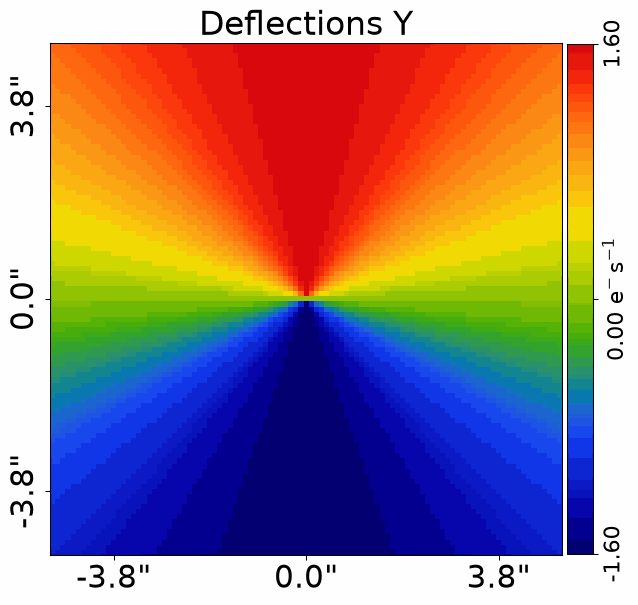
    


    
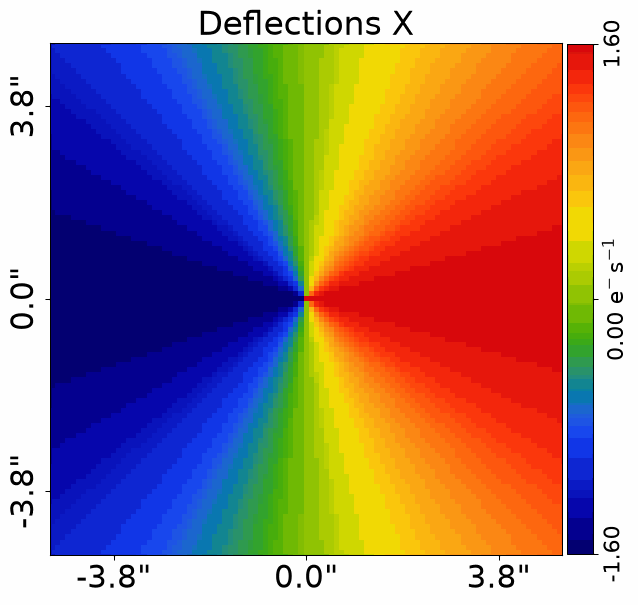
    


Mass profiles also have additional properties used in lensing calculations:

- **convergence**: Represents the surface mass density of the profile in dimensionless units.
- **potential**: Represents the "lensing potential" of the mass profile in dimensionless units.
- **magnification**: Indicates how much brighter light rays appear due to the focusing effect of lensing.

These quantities can be calculated using `*_from` methods and are returned as `Array2D` objects.


```python
convergence = sis_mass_profile.convergence_2d_from(grid=image_plane_grid)
potential_2d = sis_mass_profile.potential_2d_from(grid=image_plane_grid)
magnification_2d = al.LensCalc.from_mass_obj(
    mass_obj=sis_mass_profile
).magnification_2d_from(grid=image_plane_grid)
```

The same plotter API can be used to visualize these properties:


```python
aplt.plot_array(
    array=sis_mass_profile.convergence_2d_from(grid=image_plane_grid),
    title="Convergence",
)
aplt.plot_array(
    array=sis_mass_profile.potential_2d_from(grid=image_plane_grid), title="Potential"
)
```


    
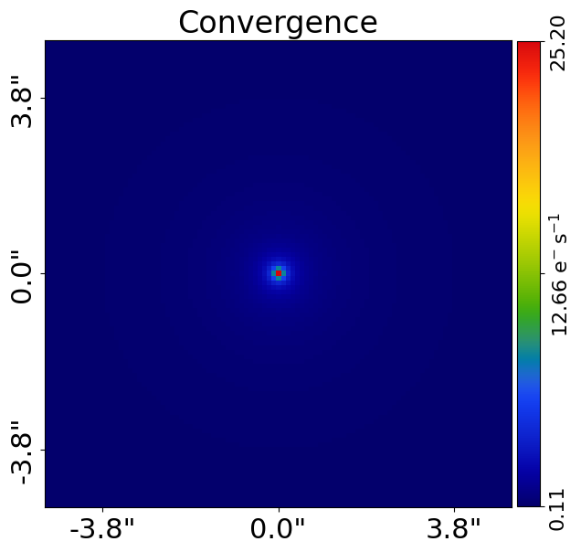
    


    
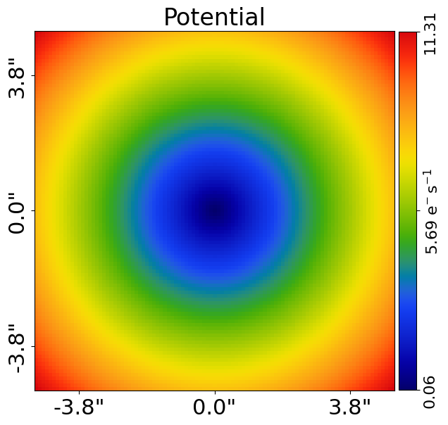
    


One-dimensional plots can also be made using the same projection technique as in the previous tutorial:


```python
grid_2d_projected = image_plane_grid.grid_2d_radial_projected_from(
    centre=sis_mass_profile.centre, angle=sis_mass_profile.angle()
)

convergence_1d = sis_mass_profile.convergence_2d_from(grid=grid_2d_projected)

plt.plot(grid_2d_projected[:, 1], convergence_1d)
plt.xlabel("Radius (arcseconds)")
plt.ylabel("Luminosity")
plt.show()
plt.close()
```


    
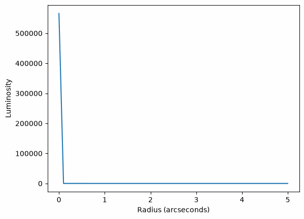
    


The **convergence** and **potential** can be better understood when plotted in logarithmic space:


```python
aplt.plot_array(
    array=sis_mass_profile.convergence_2d_from(grid=image_plane_grid),
    title="Convergence in Log10 Space",
    use_log10=True,
)
aplt.plot_array(
    array=sis_mass_profile.potential_2d_from(grid=image_plane_grid),
    title="Potential in Log10 Space",
    use_log10=True,
)
```


    
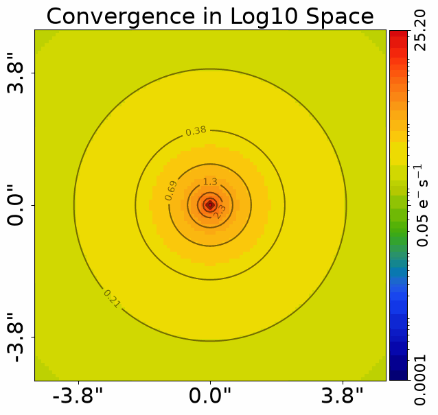
    


    
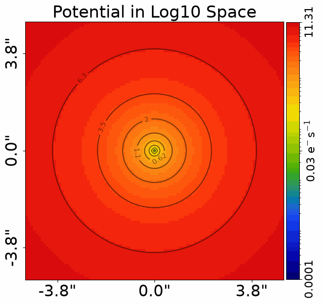
    


__Ray Tracing Grids__

We now have all the tools we need to perform our first ray-tracing calculation.

Ray tracing uses a mass profile's deflection angles to map coordinates from the image-plane (where we observe the
lensed source) to the source-plane (where the source truly is). This mapping is described by the **lens equation**:

$\beta = \theta - \alpha(\theta)$

where $\theta$ are the image-plane coordinates, $\alpha(\theta)$ are the deflection angles of the mass profile, and
$\beta$ are the corresponding source-plane coordinates.

We compute the deflection angles of our mass profile on the `image_plane_grid`, and then use the grid's
`grid_2d_via_deflection_grid_from` method to subtract them and produce the ray-traced `source_plane_grid`.


```python
deflections = sis_mass_profile.deflections_yx_2d_from(grid=image_plane_grid)

source_plane_grid = image_plane_grid.grid_2d_via_deflection_grid_from(
    deflection_grid=deflections
)
```

Let's plot the image-plane grid and the ray-traced source-plane grid.

The image-plane grid is uniform, but the source-plane grid is distorted. This distortion is caused by the mass
profile's deflection angles, which bend the light rays as they pass the lens galaxy. The coordinates near the
center of the mass are deflected the most.


```python
aplt.plot_grid(grid=image_plane_grid, title="Image Plane Grid")
aplt.plot_grid(grid=source_plane_grid, title="Source Plane Grid (Ray Traced)")
```


    

    


    
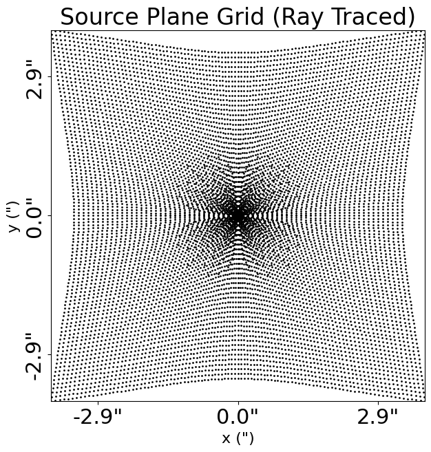
    


__Ray Tracing Images__

The source-plane grid tells us where each image-plane coordinate lands in the source-plane after being deflected.

To compute the lensed image of a source galaxy, we place a light profile in the source-plane and evaluate its light
on the ray-traced `source_plane_grid`. Because many image-plane coordinates map to the same region of the
source-plane, the source appears multiply imaged, forming arcs or a complete Einstein ring.

Let's create a source light profile and compute its lensed image.


```python
source_light_profile = al.lp.ExponentialCore(
    centre=(0.1, 0.1),
    ell_comps=(0.0, 0.1),
    intensity=0.1,
    effective_radius=0.2,
)

lensed_image = source_light_profile.image_2d_from(grid=source_plane_grid)
```

When we plot this image, the source's light appears as a strongly lensed Einstein ring.

This is the **image-plane image** or **observed image** we discussed at the start of the tutorial: the appearance
of the source *after* its light has been deflected by the lens galaxy's mass.

*Exercise*: Try changing the `centre` of the source light profile. Observe how moving the source relative to the
lens galaxy changes the lensed image from a ring into arcs or multiple images.


```python
aplt.plot_array(array=lensed_image, title="Lensed Source Image")
```


    
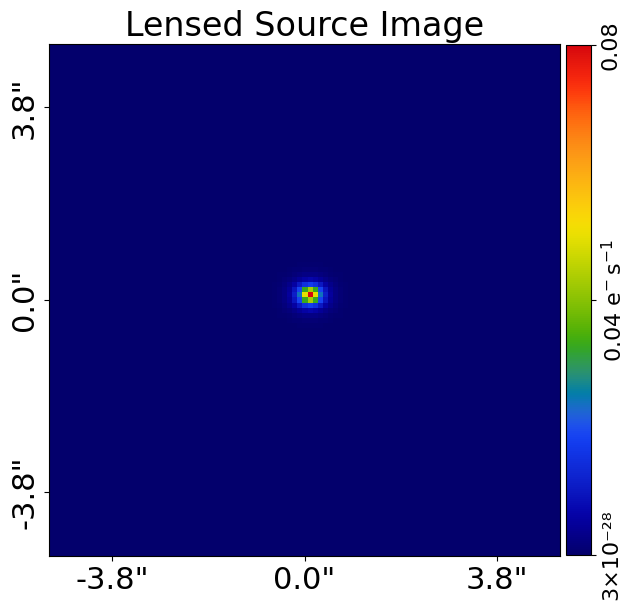
    


__Galaxies__

In the previous tutorial we saw that a `Galaxy` can contain one or more light profiles. A `Galaxy` can also contain
mass profiles, and can contain both at the same time.

This lets us construct realistic lens and source galaxies:

- The **lens galaxy** has a mass profile (which deflects light) and typically a light profile (its own emission).
- The **source galaxy** has a light profile (the light we see lensed), and is at a higher redshift.


```python
lens_galaxy = al.Galaxy(
    redshift=0.5,
    mass=sis_mass_profile,
)

source_galaxy = al.Galaxy(
    redshift=1.0,
    bulge=source_light_profile,
)

print(lens_galaxy)
print(source_galaxy)
```

    Redshift: 0.5
    Mass Profiles:
    IsothermalSph
    centre: (0.0, 0.0)
    ell_comps: (0.0, 0.0)
    einstein_radius: 1.6
    slope: 2.0
    core_radius: 0.0
    Redshift: 1.0
    Light Profiles:
    ExponentialCore
    centre: (0.1, 0.1)
    ell_comps: (0.0, 0.1)
    intensity: 0.1
    effective_radius: 0.2
    sersic_index: 1.0
    radius_break: 0.01
    alpha: 3.0
    gamma: 0.25


__Tracer__

Performing the ray-tracing calculation manually, as we did above, becomes cumbersome once we have multiple galaxies
at multiple redshifts.

The `Tracer` object automates the entire ray-tracing process. We create it from a list of galaxies, ordered by their
redshift, and it uses their redshifts and a cosmological model to set up the strong lens system.


```python
tracer = al.Tracer(galaxies=[lens_galaxy, source_galaxy])
```

The `Tracer` has an `image_2d_from` method, just like light profiles and galaxies. It performs all the ray-tracing
for us and returns the image of the entire strong lens system.

This produces the same lensed Einstein ring we computed manually above, but in a single line of code.


```python
image = tracer.image_2d_from(grid=image_plane_grid)

aplt.plot_array(array=image, title="Image of Strong Lens System via Tracer")
```


    
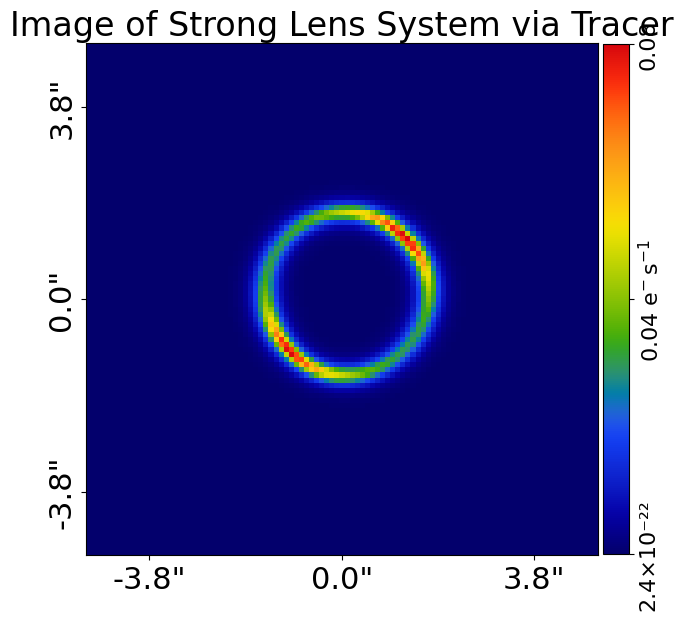
    


The `subplot_tracer` method plots a subplot of the most important quantities of the strong lens system, including
its image, convergence, potential and deflection angles.


```python
aplt.subplot_tracer(tracer=tracer, grid=image_plane_grid)
```


    
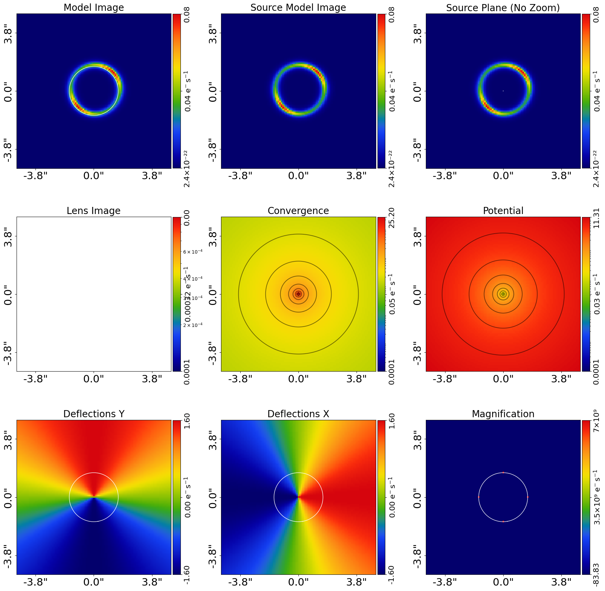
    


__Mappings__

The `Tracer` also gives us access to the grids of every plane in the strong lens system, via the
`traced_grid_2d_list_from` method.

This returns a list, where the first entry is the image-plane grid and the second entry is the ray-traced
source-plane grid. These are the same two grids we computed manually earlier, but now produced by the tracer.


```python
traced_grid_list = tracer.traced_grid_2d_list_from(grid=image_plane_grid)

image_plane_grid_traced = traced_grid_list[0]
source_plane_grid_traced = traced_grid_list[1]
```

By plotting the image-plane and source-plane grids together, we can visualize the **mappings** between them.

Every coordinate in the image-plane maps to a coordinate in the source-plane via the lens equation. This mapping is
the heart of strong lens modeling: to fit a lens, we ray-trace the image-plane grid to the source-plane, evaluate
the source's light there, and compare the resulting lensed image to the observed data.


```python
aplt.plot_grid(grid=image_plane_grid_traced, title="Image Plane Grid")
aplt.plot_grid(grid=source_plane_grid_traced, title="Source Plane Grid")
```


    
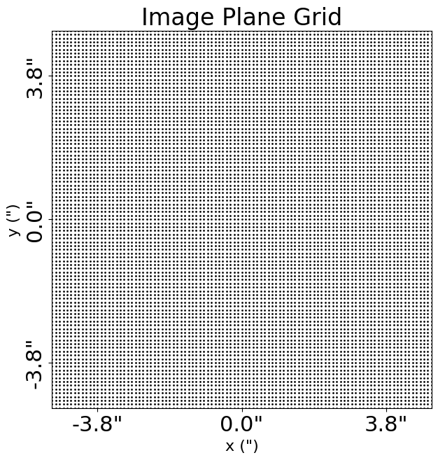
    


    
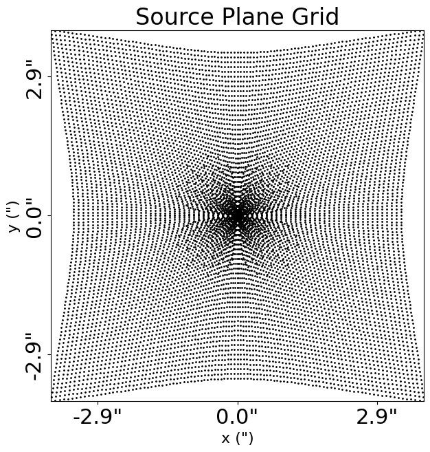
    


__Wrap Up__

In this tutorial, you performed your first lensing calculations. Let's summarise what we've learnt:

- **Mass Profiles**: Mass profiles are analytic functions that describe the mass distribution of a galaxy. They are
used to compute deflection angles, as well as the convergence and gravitational potential.

- **Ray Tracing Grids**: The lens equation, $\beta = \theta - \alpha(\theta)$, uses deflection angles to map
image-plane coordinates to the source-plane, producing a distorted ray-traced grid.

- **Ray Tracing Images**: By evaluating a source galaxy's light on the ray-traced source-plane grid, we compute the
lensed image of the source, which appears as arcs or an Einstein ring.

- **Galaxies**: A `Galaxy` can contain both light and mass profiles, allowing us to construct realistic lens and
source galaxies.

- **Tracer**: The `Tracer` object automates the ray-tracing process for a system of galaxies at different redshifts,
computing the image of the entire strong lens system in a single line of code.

In the next tutorial, we'll extend these ideas to more complex mass and light distributions, building towards the
realistic strong lens systems we observe in real data.


```python

```
