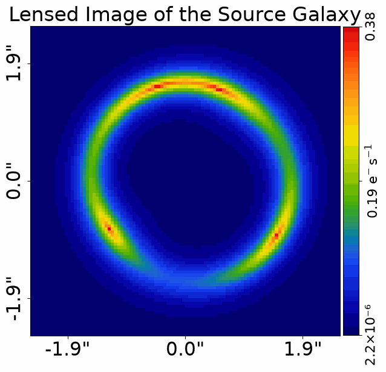
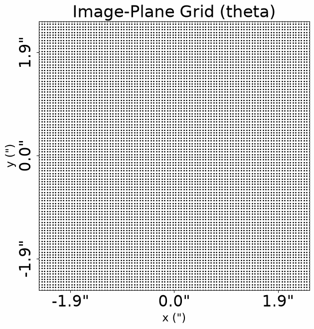
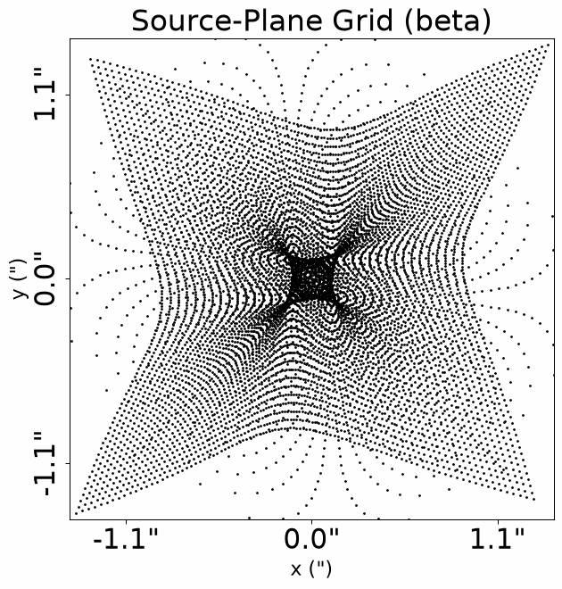
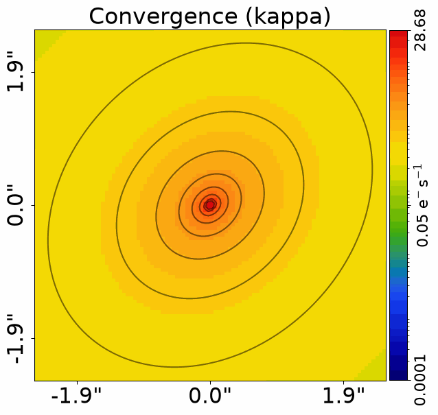
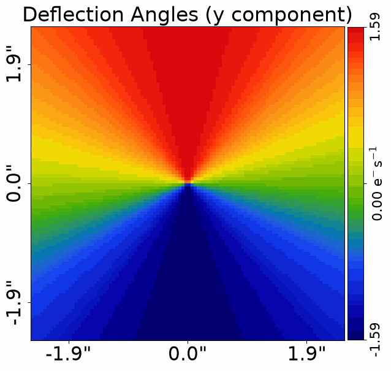
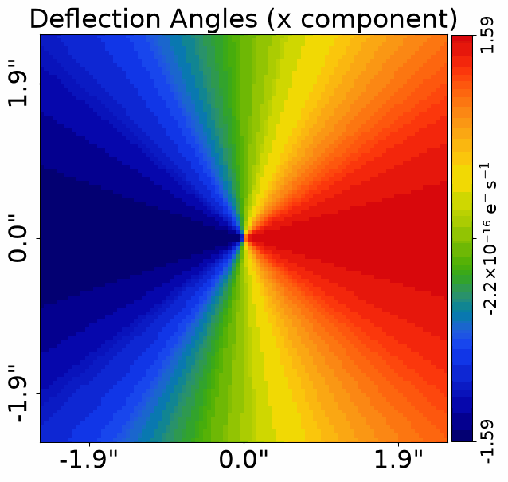
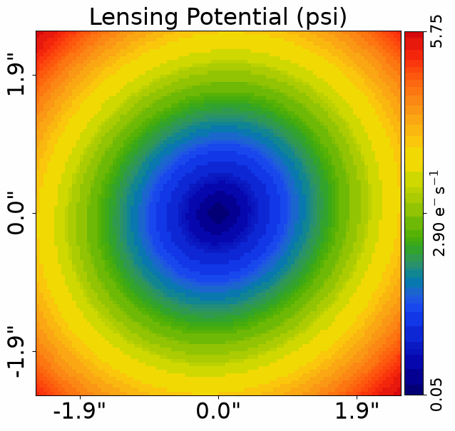
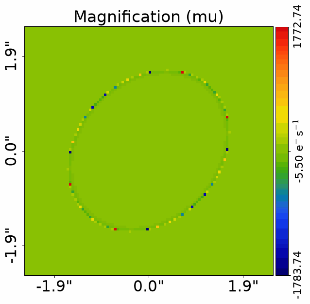
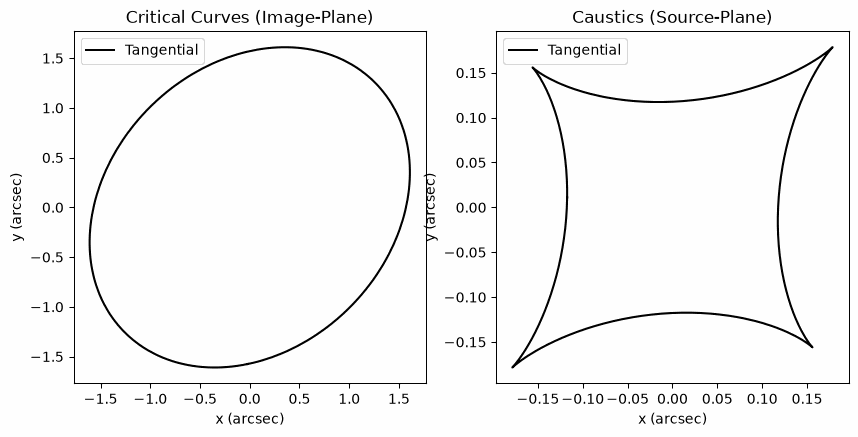
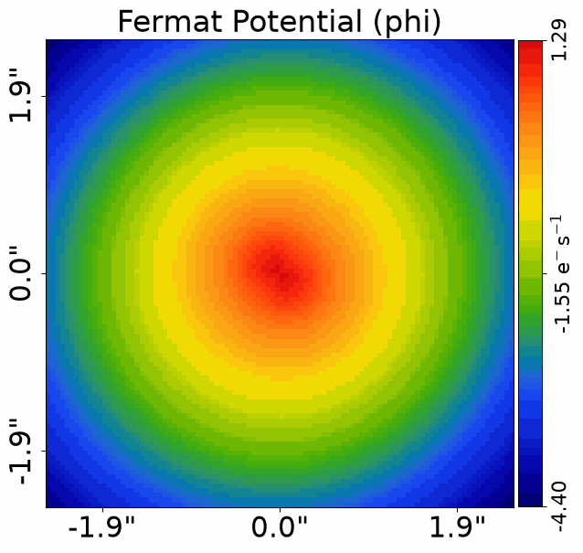

> ✏️ **This page is auto-generated from [`scripts/chapter_1_introduction/tutorial_5_lensing_formalism.py`](../../scripts/chapter_1_introduction/tutorial_5_lensing_formalism.py) — do not edit it directly.**
> It shows the example fully executed, with its real output images.
> Run it yourself via the [Python script](../../scripts/chapter_1_introduction/tutorial_5_lensing_formalism.py) or the [Jupyter notebook](../../notebooks/chapter_1_introduction/tutorial_5_lensing_formalism.ipynb).

Tutorial 5: Lensing Formalism
=============================

This tutorial is the equations lecture of **HowToLens**.

Every other tutorial in this series deliberately defers the formal mathematics of gravitational lensing, so that you
could first learn lensing hands-on: in the earlier tutorials we created grids, evaluated light and mass profiles,
ray-traced coordinates from the image-plane to the source-plane and looked at quantities like the convergence,
deflection angles and critical curves visually, without ever writing down their formal definitions.

This tutorial gathers all of that algebra in one place. Each quantity you have already computed and plotted —
deflection angles, convergence, potential, magnification, critical curves, the Einstein radius — is now given its
formal mathematical definition, explained in plain words, and tied back to the exact **PyAutoLens** method that
computes it. The goal is that after this tutorial, every symbol in a lensing paper maps to a line of code you know.

None of this mathematics is required to use **PyAutoLens** or to analyse strong lenses — the library computes
everything for you. But understanding where each quantity comes from will make you a better lens modeler, and this
is the single place in **HowToLens** where the formalism lives, so you can return here whenever you need it.

We will build one simple strong lens system — an elliptical isothermal (SIE) lens galaxy and a Sersic source — and
reuse it throughout, computing every quantity from the same tracer so you can see how they all fit together.

__Contents__

- **Initial Setup:** Build the grid, SIE lens, Sersic source and `Tracer` reused throughout the tutorial.
- **Cosmological Distances:** Angular diameter distances D_l, D_s, D_ls and how arcseconds convert to kiloparsecs.
- **The Lens Equation:** beta = theta - alpha(theta), the mapping from image-plane to source-plane, and multiple images.
- **Convergence:** Surface mass density Sigma, the critical surface density Sigma_cr and kappa = Sigma / Sigma_cr.
- **Deflection Angles:** The integral relating the convergence field to the deflection angles.
- **The Lensing Potential:** The scalar potential psi, with alpha = grad psi and kappa = (1/2) laplacian psi.
- **Shear and Magnification:** The Hessian, the Jacobian matrix A, shear gamma and magnification mu = 1 / det(A).
- **Critical Curves and Caustics:** Where det(A) = 0 in the image-plane, and its map to the source-plane.
- **Einstein Radius:** Its definition, the SIS and point-mass closed forms, and why it is the robust mass measurement.
- **Time Delays:** The Fermat potential and the time-delay surface, in brief.
- **Wrap Up:** Summary of the script and next steps.


```python

from autolens import jax_wrapper  # Sets JAX environment before other imports

from autolens import setup_notebook; setup_notebook()

import matplotlib.pyplot as plt
import numpy as np
import autolens as al
import autoarray as aa
import autolens.plot as aplt
```

    .../PyAutoNerves/autonerves/workspace.py:206: UserWarning: Cannot verify the workspace at HowToLens/scripts/chapter_1_introduction is compatible with the installed library version (2026.7.23.1): no `version.minimum_library_version` or `version.workspace_version` key in config/general.yaml and no version.txt at the workspace root.
    
    If you cloned the workspace from `main` rather than a release tag, set `version.workspace_version_check: False` in config/general.yaml to silence this warning. The `main` branch updates more frequently than library releases, so version mismatches are expected and not actionable for `main`-branch users.
    
    You can also set the environment variable PYAUTO_SKIP_WORKSPACE_VERSION_CHECK=1 to disable temporarily.
      warnings.warn(_missing_version_warning(root, library_version))
    .../PyAutoNerves/autonerves/workspace.py:206: UserWarning: Cannot verify the workspace at HowToLens/scripts/chapter_1_introduction is compatible with the installed library version (2026.7.23.1): no `version.minimum_library_version` or `version.workspace_version` key in config/general.yaml and no version.txt at the workspace root.
    
    If you cloned the workspace from `main` rather than a release tag, set `version.workspace_version_check: False` in config/general.yaml to silence this warning. The `main` branch updates more frequently than library releases, so version mismatches are expected and not actionable for `main`-branch users.
    
    You can also set the environment variable PYAUTO_SKIP_WORKSPACE_VERSION_CHECK=1 to disable temporarily.
      warnings.warn(_missing_version_warning(root, library_version))
    Working Directory has been set to `HowToLens`
    .../PyAutoNerves/autonerves/workspace.py:206: UserWarning: Cannot verify the workspace at HowToLens/scripts/chapter_1_introduction is compatible with the installed library version (2026.7.23.1): no `version.minimum_library_version` or `version.workspace_version` key in config/general.yaml and no version.txt at the workspace root.
    
    If you cloned the workspace from `main` rather than a release tag, set `version.workspace_version_check: False` in config/general.yaml to silence this warning. The `main` branch updates more frequently than library releases, so version mismatches are expected and not actionable for `main`-branch users.
    
    You can also set the environment variable PYAUTO_SKIP_WORKSPACE_VERSION_CHECK=1 to disable temporarily.
      warnings.warn(_missing_version_warning(root, library_version))


__Initial Setup__

We first build the strong lens system used throughout this tutorial, mirroring the objects introduced in tutorials
2 and 3: a 2D grid of (y,x) arcsecond coordinates, a lens galaxy with an elliptical isothermal (`Isothermal`) mass
profile — the singular isothermal ellipsoid, or SIE, the workhorse mass model of galaxy-scale lensing — and a
source galaxy with a Sersic light profile.


```python
grid = al.Grid2D.uniform(shape_native=(100, 100), pixel_scales=0.05)

mass_profile = al.mp.Isothermal(
    centre=(0.0, 0.0),
    ell_comps=al.convert.ell_comps_from(axis_ratio=0.8, angle=45.0),
    einstein_radius=1.6,
)

lens_galaxy = al.Galaxy(redshift=0.5, mass=mass_profile)

source_galaxy = al.Galaxy(
    redshift=1.0,
    bulge=al.lp.SersicCore(
        centre=(0.0, 0.1),
        ell_comps=(0.1, 0.0),
        intensity=0.3,
        effective_radius=0.3,
        sersic_index=1.0,
    ),
)
```

We combine these into a `Tracer` with a Planck 2015 cosmology. The redshifts of the two galaxies (0.5 and 1.0) and
the cosmology together fix every distance that appears in the equations below.


```python
cosmology = al.cosmo.Planck15()

tracer = al.Tracer(galaxies=[lens_galaxy, source_galaxy], cosmology=cosmology)
```

Here is the lensed image of this system, which by now should look familiar. Every equation in this tutorial is
describing some aspect of how this image forms.


```python
image = tracer.image_2d_from(grid=grid)
aplt.plot_array(array=image, title="Lensed Image of the Source Galaxy")
```


    

    


We also create a `LensCalc` object from the tracer. As we saw in tutorial 3, this is **PyAutoLens**'s calculator for
derived lensing quantities — everything it computes is derived from the tracer's deflection angles, which is a theme
we will see repeatedly below.


```python
lens_calc = al.LensCalc.from_tracer(tracer=tracer)
```

__Cosmological Distances__

Gravitational lensing is a geometric effect, so distances are everywhere in its equations. The distances used are
**angular diameter distances**, defined so that an object of physical size l at angular diameter distance D subtends
an angle (in radians):

    theta = l / D

Three distances appear in every lensing formula:

- D_l — the angular diameter distance from the observer to the lens (deflector) galaxy.
- D_s — the angular diameter distance from the observer to the source galaxy.
- D_ls — the angular diameter distance from the lens to the source.

In an expanding Universe angular diameter distances do not add linearly, so D_ls != D_s - D_l. Each is computed by
integrating the cosmological expansion history between the two redshifts, which is why the tracer requires both
galaxy redshifts and a cosmology.

The `Cosmology` object computes each of these directly (values below are in kiloparsecs):


```python
D_l = cosmology.angular_diameter_distance_to_earth_in_kpc_from(redshift=0.5)
D_s = cosmology.angular_diameter_distance_to_earth_in_kpc_from(redshift=1.0)
D_ls = cosmology.angular_diameter_distance_between_redshifts_in_kpc_from(
    redshift_0=0.5, redshift_1=1.0
)

print(f"D_l (kpc) = {D_l:.3e}")
print(f"D_s (kpc) = {D_s:.3e}")
print(f"D_ls (kpc) = {D_ls:.3e}")
```

    D_l (kpc) = 1.297e+06
    D_s (kpc) = 1.698e+06
    D_ls (kpc) = 7.252e+05


The angular diameter distance is also what converts **PyAutoLens**'s internal angular units of arcseconds into
physical distances. An angle of 1.0" at redshift z corresponds to a physical size:

    l = D(z) * (1.0" in radians)

The `Cosmology` object wraps this up as a `kpc_per_arcsec` conversion factor, which differs between the image-plane
(lens redshift) and source-plane (source redshift) because the two planes are at different distances.


```python
kpc_per_arcsec_lens = cosmology.kpc_per_arcsec_from(redshift=0.5)
kpc_per_arcsec_source = cosmology.kpc_per_arcsec_from(redshift=1.0)

print(f"kpc per arcsec at the lens (z=0.5) = {kpc_per_arcsec_lens:.4f}")
print(f"kpc per arcsec at the source (z=1.0) = {kpc_per_arcsec_source:.4f}")
```

    kpc per arcsec at the lens (z=0.5) = 6.2882
    kpc per arcsec at the source (z=1.0) = 8.2319


So our lens's Einstein radius of 1.6" corresponds to a physical scale of roughly 1.6 * 6.3 ~ 10 kpc at the lens
redshift — a sensible size for the inner regions of a massive elliptical galaxy.

__The Lens Equation__

The fundamental equation of gravitational lensing is the **lens equation**, which we met in tutorial 2:

    beta = theta - alpha(theta)

where:

- theta is the observed (image-plane) angular position of a light ray, in arcseconds.
- alpha(theta) is the (scaled) deflection angle — how much the ray is bent by the lens's gravity at position theta.
- beta is the true (source-plane) position — where the source would appear if there were no lens.

In plain words: to find where a light ray we observe at theta really came from, subtract the deflection the lens
applied to it. This is exactly the ray-tracing calculation we performed in tutorial 2, and it is worth knowing that
the deflection angle here is the "scaled" deflection: the physical bending angle of the ray multiplied by the
distance ratio D_ls / D_s, which is the convention that makes the lens equation take the simple form above.

The lens equation is trivial to evaluate one way (given theta, compute beta), but it cannot be inverted
analytically: for a strong lens, *multiple* image-plane positions theta can satisfy the equation for the *same*
source position beta. This is why strong lenses produce multiple images of a single source — and why lens modeling
works "forwards", ray-tracing image-plane grids to the source-plane rather than the other way around.

In code, the lens equation is one line — the same `grid_2d_via_deflection_grid_from` call from tutorial 2:


```python
deflections = tracer.deflections_yx_2d_from(grid=grid)

source_plane_grid = grid.grid_2d_via_deflection_grid_from(deflection_grid=deflections)

aplt.plot_grid(grid=grid, title="Image-Plane Grid (theta)")
aplt.plot_grid(grid=source_plane_grid, title="Source-Plane Grid (beta)")
```


    

    


    

    


__Convergence__

The lens galaxy's mass enters lensing via its **surface mass density** Sigma(theta): the galaxy's 3D mass density
integrated along the line of sight, giving a projected 2D mass per unit area (e.g. in solar masses per kpc^2).
Lensing only cares about this projection — two very different 3D distributions with the same projected Sigma
deflect light identically.

Whether a lens is "strong" is set by comparing Sigma to the **critical surface density**:

    Sigma_cr = (c^2 / (4 pi G)) * (D_s / (D_l * D_ls))

This is a purely cosmological quantity — it depends only on the constants c and G and the three distances from the
previous section. It has a beautiful interpretation: it is the surface density a lens needs, given this observer /
lens / source geometry, to be capable of producing multiple images.


```python
sigma_cr_kpc = cosmology.critical_surface_density_between_redshifts_solar_mass_per_kpc2_from(
    redshift_0=0.5, redshift_1=1.0
)
sigma_cr_arcsec = cosmology.critical_surface_density_between_redshifts_from(
    redshift_0=0.5, redshift_1=1.0
)

print(f"Sigma_cr (solar masses per kpc^2) = {sigma_cr_kpc:.3e}")
print(f"Sigma_cr (solar masses per arcsec^2) = {sigma_cr_arcsec:.3e}")
```

    Sigma_cr (solar masses per kpc^2) = 3.002e+09
    Sigma_cr (solar masses per arcsec^2) = 1.187e+11


The **convergence** kappa is the surface mass density in units of the critical density:

    kappa(theta) = Sigma(theta) / Sigma_cr

This is the dimensionless quantity **PyAutoLens** has been plotting since tutorial 2 whenever we called
`convergence_2d_from`:

- kappa >= 1 — the lens is super-critical at that point; multiple imaging is possible.
- kappa < 1 — the lens is sub-critical there.

Because kappa is dimensionless, lens models can be composed and fitted without knowing the galaxy redshifts at all —
the redshifts and Sigma_cr are only needed at the end, to convert the inferred kappa back into physical masses.


```python
convergence = tracer.convergence_2d_from(grid=grid)

aplt.plot_array(array=convergence, title="Convergence (kappa)", use_log10=True)
```


    

    


__Deflection Angles__

The convergence field determines the deflection angles everywhere, via a 2D integral over the whole image-plane:

    alpha(theta) = (1 / pi) * integral d^2 theta'  kappa(theta') * (theta - theta') / |theta - theta'|^2

In plain words: every patch of mass in the lens plane pulls on every light ray. The deflection at position theta is
the sum (integral) of the pulls from all mass elements kappa(theta'), each pointing from the mass element towards
the ray and falling off as 1/distance — the 2D (projected) analogue of Newtonian gravity's inverse-square law.

Two things follow from this integral being over *all* theta':

- The deflection at a point depends on the mass distribution *everywhere*, not just the mass at that point. Even
  mass well outside the region where images form contributes deflections (this is why external shear from
  neighbouring galaxies matters, as we saw in tutorial 3).

- For simple analytic profiles (isothermal, power-law, Sersic-like) this integral has closed-form solutions, which
  is exactly what a **PyAutoLens** mass profile is: an analytic kappa(theta) paired with its analytic alpha(theta).

The `deflections_yx_2d_from` method we have used since tutorial 2 evaluates this integral's closed-form solution.
The deflections form a 2D vector field, so we plot its y and x components separately:


```python
deflections = tracer.deflections_yx_2d_from(grid=grid)

deflections_y = aa.Array2D(values=deflections.slim[:, 0], mask=grid.mask)
aplt.plot_array(array=deflections_y, title="Deflection Angles (y component)")

deflections_x = aa.Array2D(values=deflections.slim[:, 1], mask=grid.mask)
aplt.plot_array(array=deflections_x, title="Deflection Angles (x component)")
```


    

    


    

    


__The Lensing Potential__

The deflection field is not arbitrary — it is the gradient of a scalar field, the **lensing potential** psi(theta):

    alpha(theta) = grad psi(theta)

The potential is itself an integral over the convergence:

    psi(theta) = (1 / pi) * integral d^2 theta'  kappa(theta') * ln|theta - theta'|

and taking the divergence of the gradient (the Laplacian) recovers the convergence with a factor of a half:

    kappa(theta) = (1/2) * laplacian psi(theta)

This is the 2D Poisson equation of lensing — the projected analogue of Newtonian gravity's del^2 Phi = 4 pi G rho.
The potential is the single most economical description of a lens: one scalar field from which the deflections
(first derivatives), and the convergence, shear and magnification (second derivatives) all follow.

The `potential_2d_from` method returns psi, which we have plotted before without defining it:


```python
potential = tracer.potential_2d_from(grid=grid)

aplt.plot_array(array=potential, title="Lensing Potential (psi)")
```


    

    


We can verify alpha = grad psi numerically. Mass profiles have a `deflections_2d_via_potential_2d_from` method which
computes the deflections by numerically differentiating the potential, rather than using the profile's closed-form
deflection formula. Across the grid the two agree closely — we print the median absolute difference, since the
finite-difference derivative is inaccurate right at the isothermal profile's central cusp, where the potential is
not smooth (the closed-form deflections have no such problem):


```python
deflections_analytic = mass_profile.deflections_yx_2d_from(grid=grid)
deflections_via_potential = mass_profile.deflections_2d_via_potential_2d_from(grid=grid)

difference = np.median(
    np.abs(np.asarray(deflections_analytic) - np.asarray(deflections_via_potential))
)
print(f"Median |alpha_analytic - grad psi| = {difference:.3e} arcsec")
```

    Median |alpha_analytic - grad psi| = 1.095e-04 arcsec


__Shear and Magnification__

How a small image is distorted by lensing is governed by how the deflection angles *change* across it — the second
derivatives of the potential. These form the 2x2 **Hessian** matrix, which `LensCalc` computes by finite
differences of the deflection field (as we saw in the workspace guides, this works for any mass distribution):

    H_yy = d(alpha_y) / d(theta_y)      H_xy = d(alpha_x) / d(theta_y)
    H_yx = d(alpha_y) / d(theta_x)      H_xx = d(alpha_x) / d(theta_x)


```python
hessian_yy, hessian_xy, hessian_yx, hessian_xx = lens_calc.hessian_from(grid=grid)

print(f"Hessian components at pixel 0: H_yy = {hessian_yy[0]:.4f}, H_xx = {hessian_xx[0]:.4f}")
```

    Hessian components at pixel 0: H_yy = 0.2032, H_xx = 0.2032


Differentiating the lens equation beta = theta - alpha(theta) gives the **Jacobian matrix** A, which maps a small
displacement in the source-plane to the corresponding displacement in the image-plane:

    A = d(beta) / d(theta) = I - H = | 1 - H_yy    -H_xy  |
                                     |  -H_yx    1 - H_xx |

The Jacobian decomposes into two physically distinct distortions:

- The **convergence** kappa = (1/2) * (H_yy + H_xx) — the isotropic part, which magnifies an image uniformly
  without changing its shape. (Note this is the same kappa as before: the trace of the Hessian recovers the
  Poisson equation kappa = (1/2) laplacian psi.)

- The **shear** gamma — the anisotropic part, which stretches an image along one axis and squeezes it along the
  perpendicular axis. It has two components and a magnitude:

      gamma_1 = (1/2) * (H_xx - H_yy)
      gamma_2 = H_xy
      |gamma| = sqrt(gamma_1^2 + gamma_2^2)

The shear is why lensed images near the lens are stretched into tangential arcs — the tidal field of the lens
elongates them around it.


```python
shear = lens_calc.shear_yx_2d_via_hessian_from(grid=grid)

print(f"Shear magnitude at pixel 0: |gamma| = {shear.magnitudes[0]:.4f}")
```

    Shear magnitude at pixel 0: |gamma| = 0.2032


The **magnification** mu is the inverse of the Jacobian's determinant:

    mu = 1 / det(A) = 1 / [ (1 - kappa)^2 - |gamma|^2 ]

Lensing conserves surface brightness, so a lensed image that covers more sky than the unlensed source appears
brighter in total by exactly the factor |mu|:

- |mu| > 1 — the image is magnified (larger and brighter than the unlensed source).
- |mu| < 1 — the image is demagnified.
- mu < 0 — the image has negative parity: it is a mirror image of the source.

The determinant factorises into two eigenvalues, giving the **tangential** and **radial** magnifications:

    lambda_t = 1 - kappa - |gamma|      (tangential eigenvalue)
    lambda_r = 1 - kappa + |gamma|      (radial eigenvalue)

    mu = 1 / (lambda_t * lambda_r)

An image is stretched by 1/lambda_t in the tangential direction (around the lens) and 1/lambda_r in the radial
direction (towards/away from the lens). Giant tangential arcs form where lambda_t is close to zero.


```python
magnification = lens_calc.magnification_2d_from(grid=grid)

aplt.plot_array(array=magnification, title="Magnification (mu)")

tangential_eigen_values = lens_calc.tangential_eigen_value_from(grid=grid)
radial_eigen_values = lens_calc.radial_eigen_value_from(grid=grid)

print(f"Tangential eigenvalue at pixel 0: {tangential_eigen_values[0]:.4f}")
print(f"Radial eigenvalue at pixel 0: {radial_eigen_values[0]:.4f}")
```


    

    


    Tangential eigenvalue at pixel 0: 0.5937
    Radial eigenvalue at pixel 0: 1.0000


__Critical Curves and Caustics__

Where either eigenvalue passes through zero, det(A) = 0 and the magnification formally diverges to infinity. The
closed curves in the image-plane where this happens are the **critical curves** — the white and yellow lines that
have appeared on plots since tutorial 2, and which we explored visually in tutorial 3:

- The **tangential critical curve** (lambda_t = 0) — roughly traces the Einstein ring; sources near its source-plane
  counterpart form giant tangential arcs.
- The **radial critical curve** (lambda_r = 0) — an inner curve associated with radially stretched central images.

Ray-tracing each critical curve through the lens equation maps it to the source-plane, where it is called a
**caustic**:

    caustic = critical_curve - alpha(critical_curve)

Caustics divide the source-plane into regions of different image multiplicity: each time a source crosses a
caustic, the number of images it produces changes by two. For our SIE lens, a source inside the tangential caustic
produces four images (plus a faint central image); between the tangential and radial caustics, two; and outside
both caustics, just one — the source is no longer multiply imaged at all.

`LensCalc` computes both by locating the zero-contours of the eigenvalue fields on the grid:


```python
tangential_critical_curve_list = lens_calc.tangential_critical_curve_list_from(grid=grid)
radial_critical_curve_list = lens_calc.radial_critical_curve_list_from(grid=grid)

tangential_caustic_list = lens_calc.tangential_caustic_list_from(grid=grid)
radial_caustic_list = lens_calc.radial_caustic_list_from(grid=grid)

print(f"Number of tangential critical curves: {len(tangential_critical_curve_list)}")
print(f"Number of radial critical curves: {len(radial_critical_curve_list)}")
```

    Number of tangential critical curves: 1
    Number of radial critical curves: 0


Lets plot the critical curves (image-plane) and caustics (source-plane) of our SIE side by side. Note how the
elliptical lens produces a tangential caustic with four cusps — the origin of the four-image "quad" configurations
seen in many real lenses.


```python
plt.figure(figsize=(10, 5))

plt.subplot(1, 2, 1)
for curve in tangential_critical_curve_list:
    curve = np.asarray(curve)
    plt.plot(curve[:, 1], curve[:, 0], color="black", label="Tangential")
for curve in radial_critical_curve_list:
    curve = np.asarray(curve)
    plt.plot(curve[:, 1], curve[:, 0], color="orange", label="Radial")
plt.gca().set_aspect("equal")
plt.title("Critical Curves (Image-Plane)")
plt.xlabel("x (arcsec)")
plt.ylabel("y (arcsec)")
plt.legend()

plt.subplot(1, 2, 2)
for curve in tangential_caustic_list:
    curve = np.asarray(curve)
    plt.plot(curve[:, 1], curve[:, 0], color="black", label="Tangential")
for curve in radial_caustic_list:
    curve = np.asarray(curve)
    plt.plot(curve[:, 1], curve[:, 0], color="orange", label="Radial")
plt.gca().set_aspect("equal")
plt.title("Caustics (Source-Plane)")
plt.xlabel("x (arcsec)")
plt.ylabel("y (arcsec)")
plt.legend()

plt.show()
plt.close()
```


    

    


__Einstein Radius__

The **Einstein radius** theta_E is the characteristic angular scale of a strong lens. For a circular lens with the
source perfectly aligned behind it, it is the radius of the Einstein ring the source forms. More generally (and
this is the definition **PyAutoLens** uses), it is the radius of the circle enclosing the same area as the
tangential critical curve:

    theta_E = sqrt(A_crit / pi)

sometimes called the "effective" Einstein radius, since an elliptical lens's critical curve is not a circle.

Two closed-form results are worth memorising. For a **point mass** M:

    theta_E = sqrt( (4 G M / c^2) * (D_ls / (D_l * D_s)) )

and for a **singular isothermal sphere** (SIS) with velocity dispersion sigma_v:

    theta_E = 4 pi * (sigma_v / c)^2 * (D_ls / D_s)

The Einstein radius is also the radius within which the *mean* convergence equals exactly one — so measuring
theta_E directly measures the projected mass enclosed within it:

    M(< theta_E) = pi * theta_E^2 * Sigma_cr

This is why the Einstein radius is celebrated as one of the most robust mass measurements in all of astrophysics:
the data pin down theta_E via the image separations almost independently of the assumed mass profile, so the
enclosed Einstein mass is trusted even when the profile's slope is not. (The main caveat, the mass-sheet
degeneracy, is discussed in the lens modeling chapters.)

`LensCalc` computes the Einstein radius from the area of the tangential critical curve, and the enclosed
"Einstein mass" in angular units (pi * theta_E^2), which Sigma_cr converts to solar masses:


```python
einstein_radius = lens_calc.einstein_radius_from(grid=grid)

print(f"Einstein radius (arcsec) = {einstein_radius:.4f}")
print(f"Einstein radius (kpc) = {einstein_radius * kpc_per_arcsec_lens:.4f}")

einstein_mass_angular = lens_calc.einstein_mass_angular_from(grid=grid)
einstein_mass_solar = einstein_mass_angular * sigma_cr_arcsec

print(f"Einstein mass (angular, arcsec^2) = {einstein_mass_angular:.4f}")
print(f"Einstein mass (solar masses) = {einstein_mass_solar:.4e}")
```

    Einstein radius (arcsec) = 1.5901
    Einstein radius (kpc) = 9.9992
    Einstein mass (angular, arcsec^2) = 7.9437
    Einstein mass (solar masses) = 9.4290e+11


Reassuringly, the Einstein radius computed from the critical curve area (~1.6") matches the `einstein_radius=1.6`
parameter we gave the `Isothermal` profile — for isothermal profiles the model parameter *is* the effective
Einstein radius, which is exactly why **PyAutoLens** parameterizes its mass profiles this way: the non-linear
search then varies the quantity the data constrain most directly.

As a second check, an `IsothermalSph` (the SIS) has a perfectly circular critical curve, so its recovered Einstein
radius equals its input parameter even more precisely:


```python
sis = al.mp.IsothermalSph(centre=(0.0, 0.0), einstein_radius=1.6)

sis_einstein_radius = al.LensCalc.from_mass_obj(mass_obj=sis).einstein_radius_from(
    grid=grid
)

print(f"SIS input Einstein radius = 1.6, recovered = {sis_einstein_radius:.4f}")
```

    SIS input Einstein radius = 1.6, recovered = 1.6000


__Time Delays__

The final piece of the formalism is time. Light rays forming different images of the same source travel different
paths and through different depths of the lens's gravitational potential, so they arrive at different times. Both
effects are captured by the **Fermat potential** (or time-delay surface):

    phi(theta) = (1/2) * |theta - beta|^2 - psi(theta)

The first term is the **geometric delay** — the extra path length of a bent ray. The second is the **gravitational
(Shapiro) delay** — light slowing as it climbs through the lens's potential. Fermat's principle states that images
form at the stationary points (minima, maxima and saddle points) of this surface, which is a wonderfully compact
restatement of the lens equation: grad phi = 0 is exactly beta = theta - alpha(theta).

The observable **time delay** between two images A and B is the difference in their Fermat potentials, scaled by
the cosmological distances:

    Delta t_AB = (1 + z_l) / c * (D_l * D_s / D_ls) * [ phi(theta_A) - phi(theta_B) ]

The distance combination (1 + z_l) * D_l * D_s / D_ls is called the **time-delay distance**, and because it is
inversely proportional to the Hubble constant, measuring time delays between the images of a variable source (a
quasar or supernova) turns a strong lens into a cosmological probe.

We only touch on this here — time delays belong to the modeling of lensed point sources, introduced in tutorial 4
and covered in depth by the `autolens_workspace` point-source material. For now, we simply plot the Fermat
potential of our lens system:


```python
fermat_potential = lens_calc.fermat_potential_from(grid=grid)

aplt.plot_array(array=fermat_potential, title="Fermat Potential (phi)")
```


    

    


__Wrap Up__

This was the mathematics lecture of **HowToLens** — every formal definition deferred by the other tutorials, in one
place. Lets summarise the chain of quantities, because it has a beautiful logical structure where everything flows
from the mass distribution and a handful of distances:

- **Distances**: the angular diameter distances D_l, D_s and D_ls set the geometry, convert arcseconds to
  kiloparsecs and define the critical surface density Sigma_cr.

- **Convergence**: kappa = Sigma / Sigma_cr is the dimensionless projected mass; kappa >= 1 marks super-critical
  regions capable of multiple imaging.

- **Deflections and potential**: kappa determines the deflection field alpha (a 2D gravity integral) and the
  lensing potential psi, tied together by alpha = grad psi and kappa = (1/2) laplacian psi.

- **The lens equation**: beta = theta - alpha(theta) maps the image-plane to the source-plane; its
  non-invertibility is why multiple images form.

- **Distortion**: the Jacobian A = I - H decomposes into convergence (isotropic) and shear gamma (anisotropic);
  magnification is mu = 1 / det(A) = 1 / (lambda_t * lambda_r).

- **Critical curves and caustics**: where det(A) = 0, magnification diverges; caustics are their source-plane
  images and set the image multiplicity.

- **Einstein radius**: the area-equivalent radius of the tangential critical curve, whose enclosed mass
  M(< theta_E) = pi * theta_E^2 * Sigma_cr is the most robust measurement strong lensing delivers.

- **Time delays**: the Fermat potential phi = (1/2)|theta - beta|^2 - psi locates images at its stationary points
  and its differences, scaled by the time-delay distance, give observable delays.

You do not need to memorise any of this to continue — **PyAutoLens** computes every one of these quantities via the
methods used above — but you now know what each method is computing and can return to this tutorial whenever a
symbol needs unpacking.

In the next tutorial, we turn from theory to observation: how telescope optics, exposure times and noise turn the
pristine images of a tracer into the CCD imaging data we actually observe, and how to simulate such data ourselves.

Finally, a signpost for much later: chapter 3's tutorial 5 on the Bayesian formalism is this tutorial's twin — the
equivalent equations lecture for pixelized source reconstruction, deriving the linear inversion and Bayesian
evidence that underpin chapter 3 just as this tutorial derived the lensing quantities underpinning chapter 1.
