> ✏️ **This page is auto-generated from [`scripts/chapter_1_introduction/tutorial_7_fitting.py`](../../scripts/chapter_1_introduction/tutorial_7_fitting.py) — do not edit it directly.**
> It shows the example fully executed, with its real output images.
> Run it yourself via the [Python script](../../scripts/chapter_1_introduction/tutorial_7_fitting.py) or the [Jupyter notebook](../../notebooks/chapter_1_introduction/tutorial_7_fitting.ipynb).

Tutorial 7: Fitting
===================

In previous tutorials, we used light profiles to create simulated images of a tracer and visualized how these images
would appear when captured by a CCD detector on a telescope like the Hubble Space Telescope.

However, this simulation process is the reverse of what astronomers typically do when analyzing real data. Usually,
astronomers start with an observation—an actual image of a strong lens - and aim to infer detailed information about the
lens’s properties, such as its mass and unlensed source properties.

To achieve this, we must fit the observed image data with a model, identifying the combination of light and mass
profiles that best matches the lens's appearance in the image. In this tutorial, we'll illustrate this process using
the imaging data simulated in the previous tutorial. Our goal is to demonstrate how we can recover the parameters of
the light profiles that we used to create the original simulation, as a proof of concept for the fitting procedure.

The process of fitting data introduces essential statistical concepts like the `model`, `residual_map`, `chi-squared`,
`likelihood`, and `noise_map`. These terms are crucial for understanding how fitting works, not only in astronomy but
also in any scientific field that involves data modeling. This tutorial will provide a detailed introduction to these
concepts and show how they are applied in practice to analyze astronomical data.

Here is an overview of what we'll cover in this tutorial:

- **Dataset**: Load the imaging dataset that we previously simulated, consisting of the image, noise map, and PSF.
- **Mask**: Apply a mask to the data, excluding regions with low signal-to-noise ratios from the analysis.
- **Masked Grid**: Create a masked grid, which contains only the coordinates of unmasked pixels, to evaluate the
  galaxy's light profile in only unmasked regions.
- **Fitting**: Fit the data with a galaxy model, computing key quantities like the model image, residuals,
  chi-squared, and log likelihood to assess the quality of the fit.
- **Bad Fits**: Demonstrate how even small deviations from the true parameters can significantly impact the fit.
- **Model Fitting**: Perform a basic model fit on a simple dataset, adjusting the model parameters to improve the
  fit quality.

__Contents__

- **Dataset:** Load the imaging dataset that we previously simulated, consisting of the image, noise map, and PSF.
- **Dataset Auto-Simulation:** Create the dataset by running the tutorial 6 script if it is not on your hard-disk.
- **Mask:** Apply a mask to the data, excluding regions with low signal-to-noise ratios from the analysis.
- **Masked Grid:** In tutorials 1 and 2, we emphasized that the `Grid2D` object is crucial for evaluating a lens's.
- **Fitting:** Fit the lens model to the dataset and inspect the results.
- **Incorrect Fit:** In the previous section, we successfully created and fitted a lens model to the image data.
- **Model Fitting:** In the previous sections, we used the true model to fit the data, which resulted in a high log.
- **Wrap Up:** Summary of the script and next steps.


```python

from autolens import jax_wrapper  # Sets JAX environment before other imports

from autolens import setup_notebook; setup_notebook()

import numpy as np
from pathlib import Path
import autolens as al
import autolens.plot as aplt
```

    .../PyAutoNerves/autonerves/workspace.py:206: UserWarning: Cannot verify the workspace at HowToLens/scripts/chapter_1_introduction is compatible with the installed library version (2026.7.23.1): no `version.minimum_library_version` or `version.workspace_version` key in config/general.yaml and no version.txt at the workspace root.
    
    If you cloned the workspace from `main` rather than a release tag, set `version.workspace_version_check: False` in config/general.yaml to silence this warning. The `main` branch updates more frequently than library releases, so version mismatches are expected and not actionable for `main`-branch users.
    
    You can also set the environment variable PYAUTO_SKIP_WORKSPACE_VERSION_CHECK=1 to disable temporarily.
      warnings.warn(_missing_version_warning(root, library_version))
    .../PyAutoNerves/autonerves/workspace.py:206: UserWarning: Cannot verify the workspace at HowToLens/scripts/chapter_1_introduction is compatible with the installed library version (2026.7.23.1): no `version.minimum_library_version` or `version.workspace_version` key in config/general.yaml and no version.txt at the workspace root.
    
    If you cloned the workspace from `main` rather than a release tag, set `version.workspace_version_check: False` in config/general.yaml to silence this warning. The `main` branch updates more frequently than library releases, so version mismatches are expected and not actionable for `main`-branch users.
    
    You can also set the environment variable PYAUTO_SKIP_WORKSPACE_VERSION_CHECK=1 to disable temporarily.
      warnings.warn(_missing_version_warning(root, library_version))
    Working Directory has been set to `HowToLens`
    .../PyAutoNerves/autonerves/workspace.py:206: UserWarning: Cannot verify the workspace at HowToLens/scripts/chapter_1_introduction is compatible with the installed library version (2026.7.23.1): no `version.minimum_library_version` or `version.workspace_version` key in config/general.yaml and no version.txt at the workspace root.
    
    If you cloned the workspace from `main` rather than a release tag, set `version.workspace_version_check: False` in config/general.yaml to silence this warning. The `main` branch updates more frequently than library releases, so version mismatches are expected and not actionable for `main`-branch users.
    
    You can also set the environment variable PYAUTO_SKIP_WORKSPACE_VERSION_CHECK=1 to disable temporarily.
      warnings.warn(_missing_version_warning(root, library_version))


__Dataset__

We begin by loading the imaging dataset that we will use for fitting in this tutorial. This dataset is identical to the 
one we simulated in the previous tutorial, representing how a lens would appear if captured by a CCD camera.

In the previous tutorial, we saved this dataset as .fits files in the `dataset/imaging/howtolens` folder of the
HowToLens repository. The `.fits` format is commonly used in astronomy for storing image data along with metadata,
making it a standard for CCD imaging.

The `dataset_path` below specifies where these files are located: `dataset/imaging/howtolens/`.


```python
dataset_path = Path("dataset") / "imaging" / "howtolens"
```

__Dataset Auto-Simulation__

The `howtolens` dataset is the one built up and saved in tutorial 6 (`tutorial_6_data.py`). If it does
not already exist on your system, it is created by running that script. This ensures every example
script can be run without manually simulating data first.


```python
if al.util.dataset.should_simulate(str(dataset_path)):
    import subprocess
    import sys

    subprocess.run(
        [sys.executable, "scripts/chapter_1_introduction/tutorial_6_data.py"],
        check=True,
    )

dataset = al.Imaging.from_fits(
    data_path=dataset_path / "data.fits",
    noise_map_path=dataset_path / "noise_map.fits",
    psf_path=dataset_path / "psf.fits",
    pixel_scales=0.1,
)
```

The `Imaging` object contains three key components: `data`, `noise_map`, and `psf`:

- `data`: The actual image of the lens, which we will analyze.

- `noise_map`: A map indicating the uncertainty or noise level in each pixel of the image, reflecting how much the 
  observed signal in each pixel might fluctuate due to instrumental or background noise.
  
- `psf`: The Point Spread Function, which describes how a point source of light is spread out in the image by the 
  telescope's optics. It characterizes the blurring effect introduced by the instrument.

Let's print some values from these components and plot a summary of the dataset to refresh our understanding of the 
imaging data.


```python
print("Value of first pixel in imaging data:")
print(dataset.data.native[0, 0])
print("Value of first pixel in noise map:")
print(dataset.noise_map.native[0, 0])
print("Value of first pixel in PSF:")
print(dataset.psf.kernel.native[0, 0])

aplt.subplot_imaging_dataset(dataset=dataset)
```

    Value of first pixel in imaging data:
    0.053333333333333316
    Value of first pixel in noise map:
    0.02260776661041756
    Value of first pixel in PSF:
    2.210334945638401e-12


    
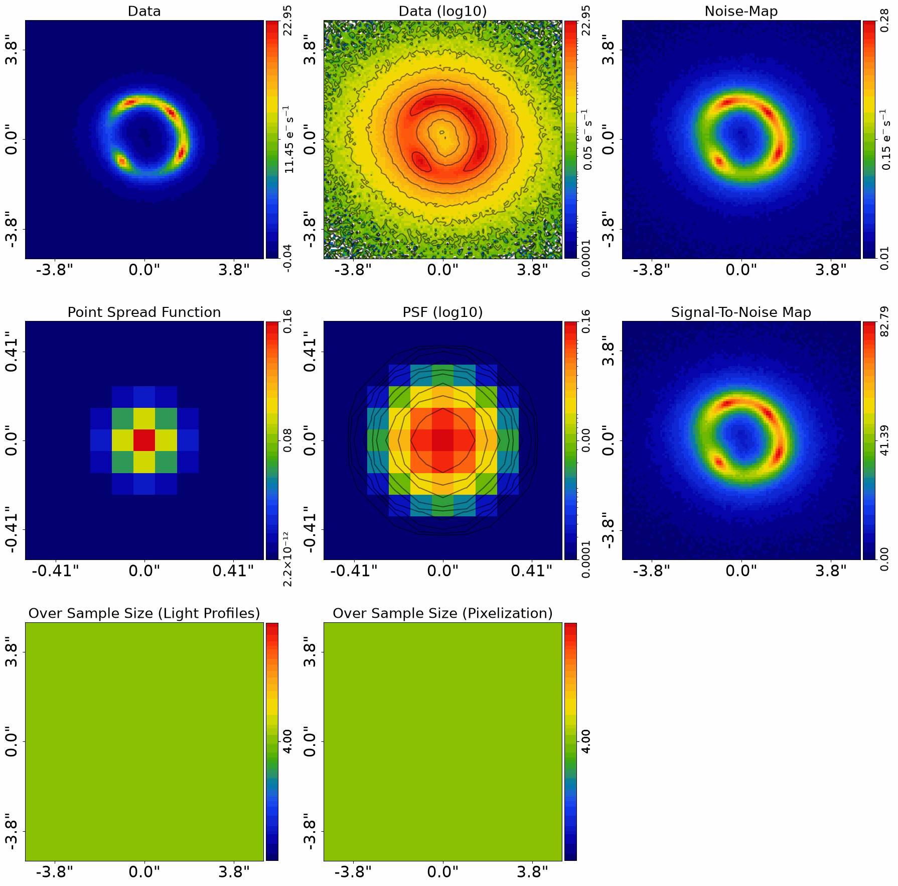
    


__Mask__

The signal-to-noise map of the image highlights areas where the signal (light from the lens and source galaxies)
is detected above the  background noise. Values above 3.0 indicate regions where the light is detected with a 
signal-to-noise ratio of at least 3, while values below 3.0 are dominated by noise, where the light is not 
clearly distinguishable.

To ensure the fitting process focuses only on meaningful data, we typically mask out regions with low signal-to-noise 
ratios, removing areas dominated by noise from the analysis. This allows the fitting process to concentrate on the 
regions where the lens is clearly detected.

Here, we create a `Mask2D` to exclude certain regions of the image from the analysis. The mask defines which parts of 
the image will be used during the fitting process.

For our simulated image, a circular 3" mask centered at the center of the image is appropriate, since the simulated 
lens was positioned at the center.


```python
mask = al.Mask2D.circular(
    shape_native=dataset.shape_native,
    pixel_scales=dataset.pixel_scales,
    radius=3.0,  # The circular mask's radius in arc-seconds
    centre=(0.0, 0.0),  # center of the image which is also the center of the lens
)

print(mask)  # 1 = True, meaning the pixel is masked. Edge pixels are indeed masked.
print(mask[48:53, 48:53])  # Central pixels are `False` and therefore unmasked.
```

    Mask2D([[ True,  True,  True, ...,  True,  True,  True],
           [ True,  True,  True, ...,  True,  True,  True],
           [ True,  True,  True, ...,  True,  True,  True],
           ...,
           [ True,  True,  True, ...,  True,  True,  True],
           [ True,  True,  True, ...,  True,  True,  True],
           [ True,  True,  True, ...,  True,  True,  True]], shape=(101, 101))
    [[False False False False False]
     [False False False False False]
     [False False False False False]
     [False False False False False]
     [False False False False False]]


We can visualize the mask over the strong lens image using an `aplt.subplot_imaging_dataset`, which helps us adjust the mask as needed. 
This is useful to ensure that the mask appropriately covers the lens and source light and does not exclude important 
regions.

To overlay objects like a mask onto a figure, we use the `lines=`/`positions=` overlays object. This tool allows us to add custom 
visuals to any plot, providing flexibility in creating tailored visual representations.


```python

aplt.plot_array(array=dataset.data, title="Imaging Data With Mask")
```


    
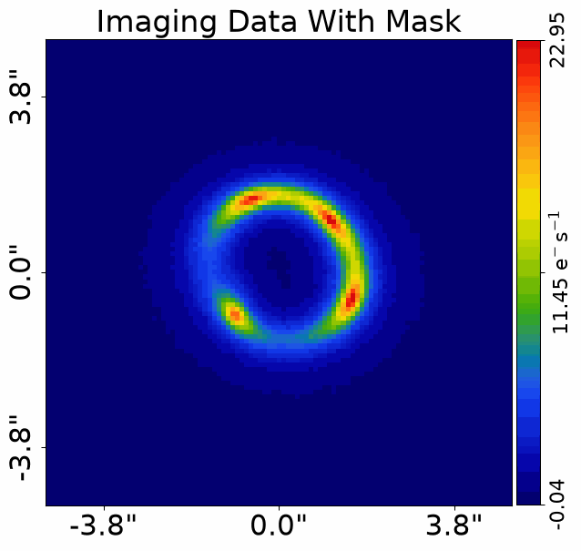
    


Once we are satisfied with the mask, we apply it to the imaging data using the `apply_mask()` method. This ensures 
that only the unmasked regions are considered during the analysis.


```python
dataset = dataset.apply_mask(mask=mask)
```

    2026-08-06 13:37:34,866 - autoarray.dataset.imaging.dataset - INFO - IMAGING - Data masked, contains a total of 2809 image-pixels


When we plot the masked imaging data again, the mask is now automatically included in the plot, even though we did 
not explicitly pass it using the `lines=`/`positions=` overlays object. The plot also zooms into the unmasked area, showing only the 
region where we will focus our analysis. This is particularly helpful when working with large images, as it centers 
the view on the regions where the strong lens's signal is detected.


```python
aplt.plot_array(array=dataset.data, title="Masked Imaging Data")
```


    
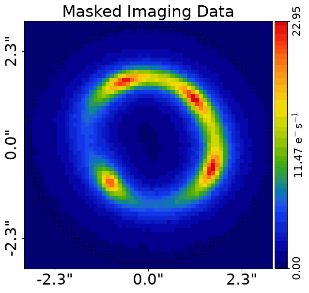
    


The mask is now stored as an additional attribute of the `Imaging` object, meaning it remains attached to the 
dataset. This makes it readily available when we pass the dataset to a `FitImaging` object for the fitting process.


```python
print("Mask2D:")
print(dataset.mask)
```

    Mask2D:
    Mask2D([[ True,  True,  True, ...,  True,  True,  True],
           [ True,  True,  True, ...,  True,  True,  True],
           [ True,  True,  True, ...,  True,  True,  True],
           ...,
           [ True,  True,  True, ...,  True,  True,  True],
           [ True,  True,  True, ...,  True,  True,  True],
           [ True,  True,  True, ...,  True,  True,  True]], shape=(101, 101))


In earlier tutorials, we discussed how grids and arrays have `native` and `slim` representations:

- `native`: Represents the original 2D shape of the data, maintaining the full pixel array of the image.
- `slim`: Represents a 1D array containing only the values from unmasked pixels, allowing for more efficient 
  processing when working with large images.

After applying the mask, the `native` and `slim` representations change as follows:

- `native`: The 2D array keeps its original shape, [total_y_pixels, total_x_pixels], but masked pixels (those where 
  the mask is True) are set to 0.0.
- `slim`: This now only contains the unmasked pixel values, reducing the array size 
  from [total_y_pixels * total_x_pixels] to just the number of unmasked pixels.

Let's verify this by checking the shape of the data in its `slim` representation.


```python
print("Number of unmasked pixels:")
print(dataset.data.native.shape)
print(
    dataset.data.slim.shape
)  # This should be lower than the total number of pixels, e.g., 100 x 100 = 10,000
```

    Number of unmasked pixels:
    (101, 101)
    (2809,)


The `mask` object also has a `pixels_in_mask` attribute, which gives the number of unmasked pixels. This should 
match the size of the `slim` data structure.


```python
print(dataset.data.mask.pixels_in_mask)
```

    2809


We can use the `slim` attribute to print the first unmasked values from the image and noise map:


```python
print("First unmasked image value:")
print(dataset.data.slim[0])
print("First unmasked noise map value:")
print(dataset.noise_map.slim[0])
```

    First unmasked image value:
    0.4633333333333334
    First unmasked noise map value:
    0.043333333333333335


Additionally, we can verify that the `native` data structure has zeros at the edges where the mask is applied and 
retains non-zero values in the central unmasked regions.


```python
print("Example masked pixel in the image's native representation at its edge:")
print(dataset.data.native[0, 0])
print("Example unmasked pixel in the image's native representation at its center:")
centre = tuple(s // 2 for s in dataset.data.shape_native)
print(dataset.data.native[centre])
```

    Example masked pixel in the image's native representation at its edge:
    0.0
    Example unmasked pixel in the image's native representation at its center:
    0.52


__Masked Grid__

In tutorials 1 and 2, we emphasized that the `Grid2D` object is crucial for evaluating a lens's light profile. This grid 
contains (y, x) coordinates for each pixel in the image and is used to ray-trace to the source plane and map out the 
positions where the source galaxy's light is calculated.

From a `Mask2D`, we derive a `masked_grid`, which consists only of the coordinates of unmasked pixels. This ensures 
that light profile calculations focus exclusively on regions where the strong lens's light is detected, saving 
computational time and improving efficiency.

Below, we plot the masked grid:


```python
masked_grid = mask.derive_grid.unmasked

aplt.plot_grid(grid=masked_grid, title="Masked Grid2D")
```


    
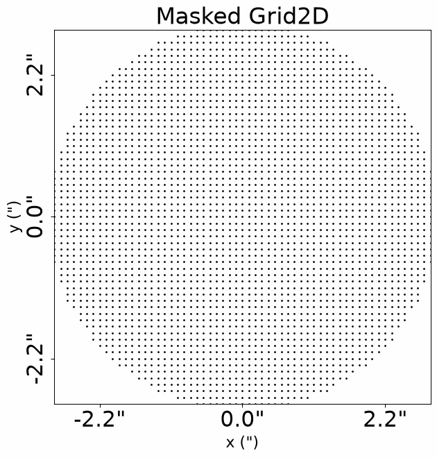
    


By plotting this masked grid over the lens image, we can see that the grid aligns with the unmasked pixels of the 
image.

This alignment **is crucial** for accurate fitting because it ensures that when we evaluate a strong lens's light 
profile, the calculations occur only at positions where we have real data from.


```python
aplt.plot_array(array=dataset.data, title="Image Data With 2D Grid Overlaid")
```


    
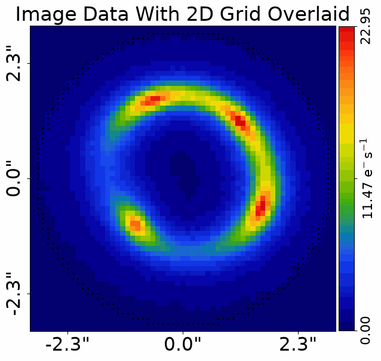
    


__Fitting__

Now that our data is masked, we are ready to proceed with the fitting process.

Fitting the data is done using the `Galaxy` and `Tracer objects that we introduced in previous tutorials. We will start by 
setting up a `Tracer`` object, using the same galaxy configuration that we previously used to simulate the 
imaging data. This setup will give us what is known as a 'perfect' fit, as the simulated and fitted models are identical.


```python
lens_galaxy = al.Galaxy(
    redshift=0.5,
    mass=al.mp.Isothermal(
        centre=(0.0, 0.0), einstein_radius=1.6, ell_comps=(0.17647, 0.0)
    ),
)

source_galaxy = al.Galaxy(
    redshift=1.0,
    bulge=al.lp.Sersic(
        centre=(0.1, 0.1),
        ell_comps=(0.0, 0.111111),
        intensity=1.0,
        effective_radius=1.0,
        sersic_index=2.5,
    ),
)


tracer = al.Tracer(galaxies=[lens_galaxy, source_galaxy])

aplt.plot_array(array=tracer.image_2d_from(grid=dataset.grid), title="Image")
```


    
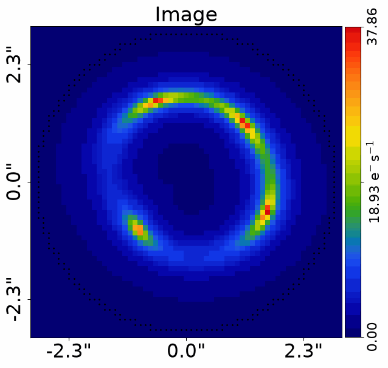
    


Next, let's plot the image of the tracer. This should look familiar, as it is the same image we saw in 
previous tutorials. The difference now is that we use the dataset's `grid`, which corresponds to the `masked_grid` 
we defined earlier. This means that the tracer image is only evaluated in the unmasked region, skipping calculations 
in masked regions.


```python
aplt.plot_array(
    array=tracer.image_2d_from(grid=dataset.grid), title="Tracer Image To Be Fitted"
)
```


    
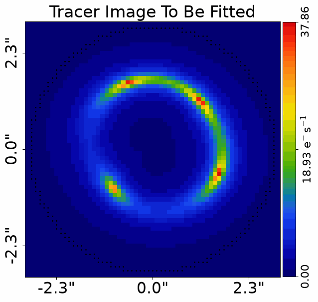
    


Now, we proceed to fit the image by passing both the `Imaging` and `Tracer` objects to a `FitImaging` object. 
This object will compute key quantities that describe the fit’s quality:

`image`: Creates an image of the tracer using their image_2d_from() method.
`model_data`: Convolves the tracer image with the data's PSF to account for the effects of telescope optics.
`residual_map`: The difference between the model data and observed data.
`normalized_residual_map`: Residuals divided by noise values, giving units of noise.
`chi_squared_map`: Squares the normalized residuals.
`chi_squared` and `log_likelihood`: Sums the chi-squared values to compute chi_squared, and converts this into 
a log_likelihood, which measures how well the model fits the data (higher values indicate a better fit).

Let's create the fit and inspect each of these attributes:


```python
fit = al.FitImaging(dataset=dataset, tracer=tracer)
```

The `model_data` represents the tracer's image after accounting for effects like PSF convolution. 

An important technical note is that when we mask data, we discussed above how the image of the tracer is not evaluated
outside the mask and is set to zero. This is a problem for PSF convolution, as the PSF blurs light from these regions
outside the mask but at its edge into the mask. They must be correctly evaluated to ensure the model image accurately
represents the image data.

The `FitImaging` object handles this internally, but evaluating the model image in the additional regions outside the mask
that are close enough to the mask edge to be blurred into the mask. 


```python
print("First model image pixel:")
print(fit.model_data.slim[0])
aplt.plot_array(array=fit.model_data, title="Model Image")
```

    First model image pixel:
    0.4831484402089213


    
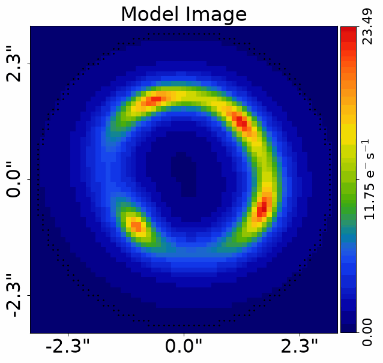
    


Even before computing other fit quantities, we can normally assess if the fit is going to be good by visually comparing
the `data` and `model_data` and assessing if they look similar.

In this example, the tracer used to fit the data are the same as the tracer used to simulate it, so the two
look very similar (the only difference is the noise in the image).


```python
aplt.plot_array(array=fit.data, title="Data")
aplt.plot_array(array=fit.model_data, title="Model Image")
```


    
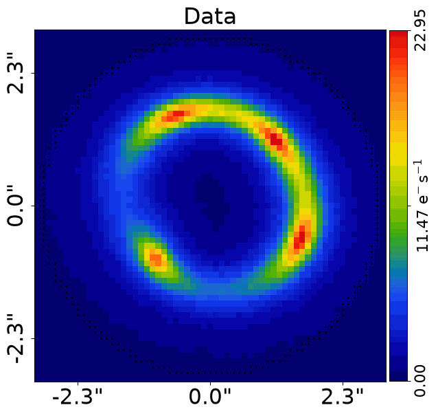
    


    
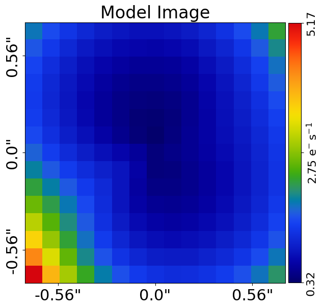
    


The `residual_map` is the different between the observed image and model image, showing where in the image the fit is
good (e.g. low residuals) and where it is bad (e.g. high residuals).

The expression for the residual map is simply:

\[ \text{residual} = \text{data} - \text{model\_data} \]

The residual-map is plotted below, noting that all values are very close to zero because the fit is near perfect.
The only non-zero residuals are due to noise in the image.


```python
residual_map = dataset.data - fit.model_data
print("First residual-map pixel:")
print(residual_map.slim[0])

print("First residual-map pixel via fit:")
print(fit.residual_map.slim[0])

aplt.plot_array(array=fit.residual_map, title="Residual Map")
```

    First residual-map pixel:
    -0.019815106875587907
    First residual-map pixel via fit:
    -0.019815106875587907


    
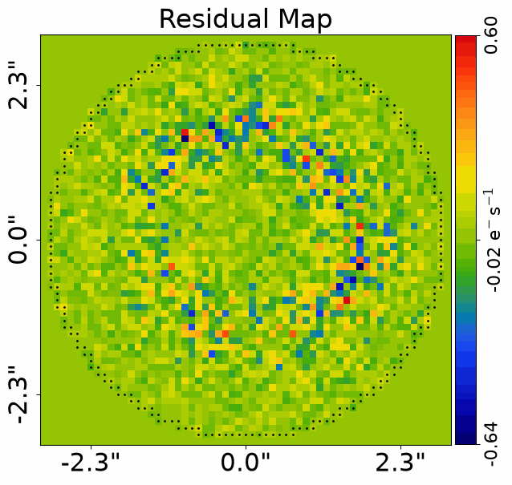
    


Are these residuals indicative of a good fit to the data? Without considering the noise in the data, it's difficult 
to ascertain. That is, its hard to ascenrtain if a residual value is large or small because this depends on the
amount of noise in that pixel.

The `normalized_residual_map` divides the residual-map by the noise-map, giving the residual in units of the noise.
Its expression is:

\[ \text{normalized\_residual} = \frac{\text{residual\_map}}{\text{noise\_map}} = \frac{\text{data} - \text{model\_data}}{\text{noise\_map}} \]

If you're familiar with the concept of standard deviations (sigma) in statistics, the normalized residual map represents 
how many standard deviations the residual is from zero. For instance, a normalized residual of 2.0 (corresponding 
to a 95% confidence interval) means that the probability of the model underestimating the data by that amount is only 5%.


```python
normalized_residual_map = residual_map / dataset.noise_map

print("First normalized residual-map pixel:")
print(normalized_residual_map.slim[0])

print("First normalized residual-map pixel via fit:")
print(fit.normalized_residual_map.slim[0])

aplt.plot_array(array=fit.normalized_residual_map, title="Normalized Residual Map")
```

    First normalized residual-map pixel:
    -0.45727169712895166
    First normalized residual-map pixel via fit:
    -0.45727169712895166


    
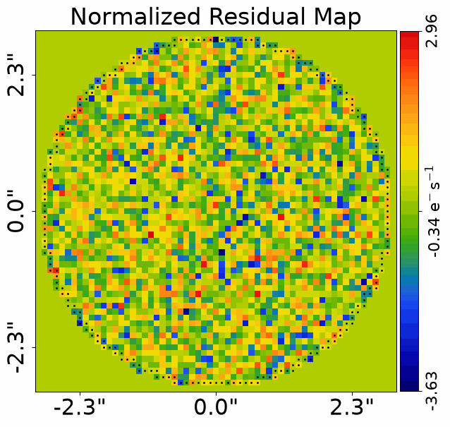
    


Next, we define the `chi_squared_map`, which is obtained by squaring the `normalized_residual_map` and serves as a 
measure of goodness of fit.

The chi-squared map is calculated as:

\[ \chi^2 = \left(\frac{\text{data} - \text{model\_data}}{\text{noise\_map}}\right)^2 \]

Squaring the normalized residual map ensures all values are positive. For instance, both a normalized residual of -0.2 
and 0.2 would square to 0.04, indicating the same quality of fit in terms of `chi_squared`.

As seen from the normalized residual map, it's evident that the model provides a good fit to the data, in this
case because the chi-squared values are close to zero.


```python
chi_squared_map = (normalized_residual_map) ** 2
print("First chi-squared pixel:")
print(chi_squared_map.slim[0])

print("First chi-squared pixel via fit:")
print(fit.chi_squared_map.slim[0])

aplt.plot_array(array=fit.chi_squared_map, title="Chi Squared Map")
```

    First chi-squared pixel:
    0.2090974049951917
    First chi-squared pixel via fit:
    0.2090974049951917


    
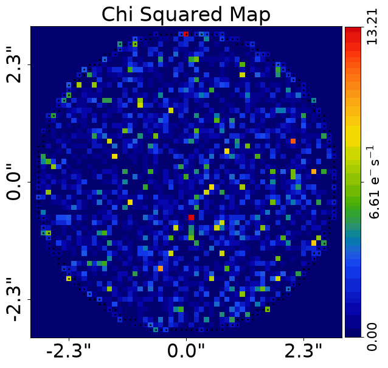
    


Now, we consolidate all the information in our `chi_squared_map` into a single measure of goodness-of-fit 
called `chi_squared`. 

It is defined as the sum of all values in the `chi_squared_map` and is computed as:

\[ \chi^2 = \sum \left(\frac{\text{data} - \text{model\_data}}{\text{noise\_map}}\right)^2 \]

This summing process highlights why ensuring all values in the chi-squared map are positive is crucial. If we 
didn't square the values (making them positive), positive and negative residuals would cancel each other out, 
leading to an inaccurate assessment of the model's fit to the data.

The lower the `chi_squared`, the fewer residuals exist between the model's fit and the data, indicating a better 
overall fit!


```python
chi_squared = np.sum(chi_squared_map)
print("Chi-squared = ", chi_squared)
print("Chi-squared via fit = ", fit.chi_squared)
```

    Chi-squared =  2870.509352378347
    Chi-squared via fit =  2870.509352378347


The reduced chi-squared is the `chi_squared` value divided by the number of data points (e.g., the number of pixels
in the mask). 

This quantity offers an intuitive measure of the goodness-of-fit, as it normalizes the `chi_squared` value by the
number of data points. That is, a reduced chi-squared of 1.0 indicates that the model provides a good fit to the data,
because every data point is fitted with a chi-squared value of 1.0.

A reduced chi-squared value significantly greater than 1.0 indicates that the model is not a good fit to the data,
whereas a value significantly less than 1.0 suggests that the model is overfitting the data.


```python
reduced_chi_squared = chi_squared / dataset.mask.pixels_in_mask
print("Reduced Chi-squared = ", reduced_chi_squared)
```

    Reduced Chi-squared =  1.0218972418577241


Another quantity that contributes to our final assessment of the goodness-of-fit is the `noise_normalization`.

The `noise_normalization` is computed by summing, over every pixel, the logarithm of 2 pi times the squared noise value:

\[
\text{{noise\_normalization}} = \sum \log(2 \pi \text{{noise\_map}}^2)
\]

This quantity is fixed because the noise-map remains constant throughout the fitting process. Despite this, 
including the `noise_normalization` is considered good practice due to its statistical significance.

Understanding the exact meaning of `noise_normalization` isn't critical for our primary goal of successfully 
fitting a model to a dataset. Essentially, it provides a measure of how well the noise properties of our data align 
with a Gaussian distribution.


```python
noise_normalization = np.sum(np.log(2 * np.pi * dataset.noise_map**2))
print("Noise Normalization = ", noise_normalization)
print("Noise Normalization via fit = ", fit.noise_normalization)
```

    Noise Normalization =  -8670.33617182735
    Noise Normalization via fit =  -8670.33617182735


From the `chi_squared` and `noise_normalization`, we can define a final goodness-of-fit measure known as 
the `log_likelihood`. 

This measure is calculated by taking the sum of the `chi_squared` and `noise_normalization`, and then multiplying the 
result by -0.5:

\[ \text{log\_likelihood} = -0.5 \times \left( \chi^2 + \text{noise\_normalization} \right) \]

Don't worry about why we multiply by -0.5; it's a standard practice in statistics to ensure the log likelihood is
defined correctly.


```python
log_likelihood = -0.5 * (chi_squared + noise_normalization)
print("Log Likelihood = ", log_likelihood)
print("Log Likelihood via fit = ", fit.log_likelihood)
```

    Log Likelihood =  2899.9134097245014
    Log Likelihood via fit =  2899.9134097245014


In the previous discussion, we noted that a lower \(\chi^2\) value indicates a better fit of the model to the 
observed data. 

When we calculate the log likelihood, we take the \(\chi^2\) value and multiply it by -0.5. This means that a 
higher log likelihood corresponds to a better model fit. Our goal when fitting models to data is to maximize the 
log likelihood.

The **reduced \(\chi^2\)** value provides an intuitive measure of goodness-of-fit. Values close to 1.0 suggest a 
good fit, while values below or above 1.0 indicate potential underfitting or overfitting of the data, respectively. 
In contrast, the log likelihood values can be less intuitive. For instance, a log likelihood value printed above 
might be around 5300.

However, log likelihoods become more meaningful when we compare them. For example, if we have two models, one with 
a log likelihood of 5300 and the other with 5310 we can conclude that the first model fits the data better 
because it has a higher log likelihood by 10.0. 

In fact, the difference in log likelihood between models can often be associated with a probability indicating how 
much better one model fits the data compared to another. This can be expressed in terms of standard deviations (sigma). 

As a rule of thumb:

- A difference in log likelihood of **2.5** suggests that one model is preferred at the **2.0 sigma** level.
- A difference in log likelihood of **5.0** indicates a preference at the **3.0 sigma** level.
- A difference in log likelihood of **10.0** suggests a preference at the **5.0 sigma** level.

All these metrics can be visualized together using the `aplt.subplot_fit_imaging` object, which offers a comprehensive 
overview of the fit quality. It also shows separate model images for the lens and source galaxies, and the appearance
of the source galaxy in the image and source planes.


```python
fit = al.FitImaging(dataset=dataset, tracer=tracer)

aplt.subplot_fit_imaging(fit=fit)
```


    
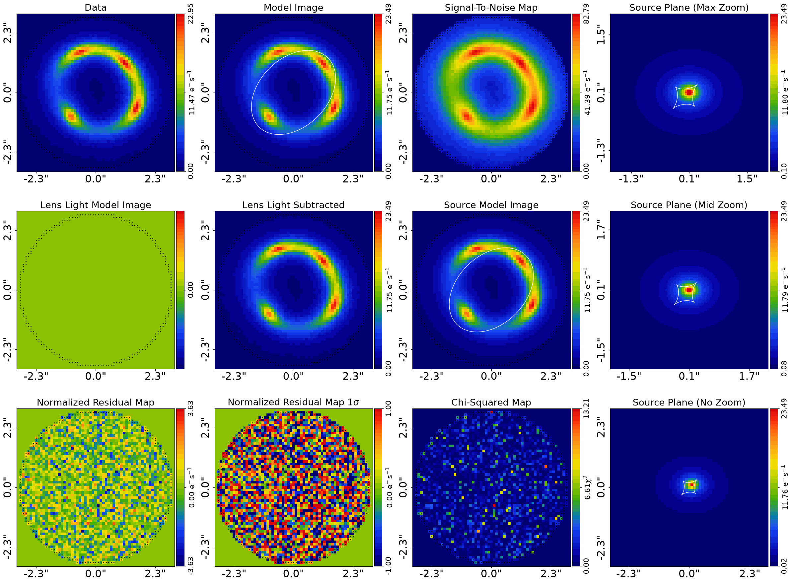
    


If you're familiar with model-fitting, you've likely encountered terms like 'residuals', 'chi-squared', 
and 'log_likelihood' before. 

These metrics are standard ways to quantify the quality of a model fit. They are applicable not only to 1D data but 
also to more complex data structures like 2D images, 3D data cubes, or any other multidimensional datasets.

__Incorrect Fit__

In the previous section, we successfully created and fitted a lens model to the image data, resulting in an 
excellent fit. The residual map and chi-squared map showed no significant discrepancies, indicating that the 
strong lens's light was accurately captured by our model. This optimal solution translates to one of the highest log 
likelihood values possible, reflecting a good match between the model and the observed data.

Now, let's modify our lens model to create a fit that is close to the correct solution but slightly off. 
Specifically, we will slightly offset the center of the source galaxy by half a pixel (0.05") in both the x and y 
directions. This change will allow us to observe how even small deviations from the true parameters can impact the 
quality of the fit.


```python
lens_galaxy = al.Galaxy(
    redshift=0.5,
    mass=al.mp.Isothermal(
        centre=(0.0, 0.0), einstein_radius=1.6, ell_comps=(0.17647, 0.0)
    ),
)

source_galaxy = al.Galaxy(
    redshift=1.0,
    bulge=al.lp.Sersic(
        centre=(0.15, 0.15),
        ell_comps=(0.0, 0.111111),
        intensity=1.0,
        effective_radius=1.0,
        sersic_index=2.5,
    ),
)


tracer = al.Tracer(galaxies=[lens_galaxy, source_galaxy])

aplt.plot_array(array=tracer.image_2d_from(grid=dataset.grid), title="Image")
```


    
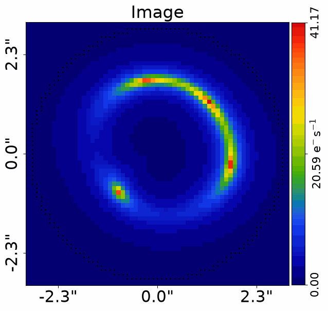
    


After implementing this slight adjustment, we can now plot the fit. In doing so, we observe that residuals have 
emerged at the multiple images of the lensed source, which indicates a mismatch between our model and the data. 
Consequently, this discrepancy results in increased chi-squared values, which in turn affects our log likelihood.


```python
fit_bad = al.FitImaging(dataset=dataset, tracer=tracer)

aplt.subplot_fit_imaging(fit=fit_bad)
```


    
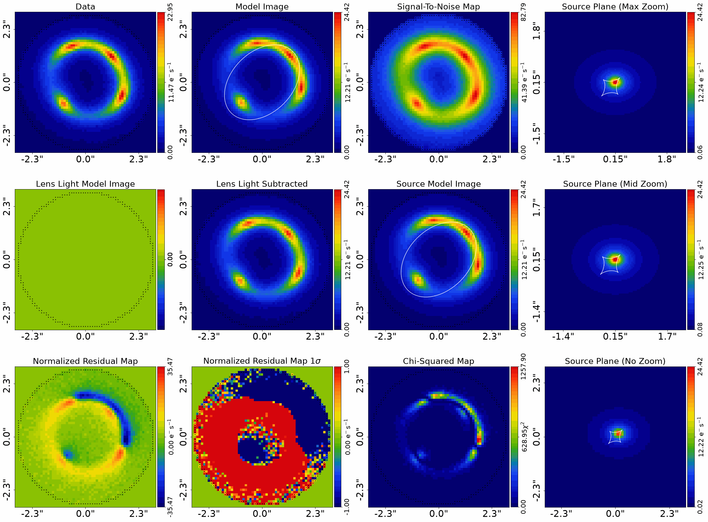
    


Next, we can compare the log likelihood of our current model to the log likelihood value we computed previously.


```python
print("Previous Likelihood:")
print(fit.log_likelihood)
print("New Likelihood:")
print(fit_bad.log_likelihood)
```

    Previous Likelihood:
    2899.9134097245014
    New Likelihood:
    -64618.8911885303


As expected, we observe that the log likelihood has decreased! This decline confirms that our new model is indeed a 
worse fit to the data compared to the original model.

Now, let’s change our lens model once more, this time setting it to a position that is far from the true parameters. 
We will offset the source's center significantly to see how this extreme deviation affects the fit quality.


```python
lens_galaxy = al.Galaxy(
    redshift=0.5,
    mass=al.mp.Isothermal(
        centre=(0.0, 0.0), einstein_radius=1.6, ell_comps=(0.17647, 0.0)
    ),
)

source_galaxy = al.Galaxy(
    redshift=1.0,
    bulge=al.lp.Sersic(
        centre=(0.5, 0.5),
        ell_comps=(0.0, 0.111111),
        intensity=1.0,
        effective_radius=1.0,
        sersic_index=2.5,
    ),
)


tracer = al.Tracer(galaxies=[lens_galaxy, source_galaxy])

fit_very_bad = al.FitImaging(dataset=dataset, tracer=tracer)

aplt.subplot_fit_imaging(fit=fit_very_bad)
```


    
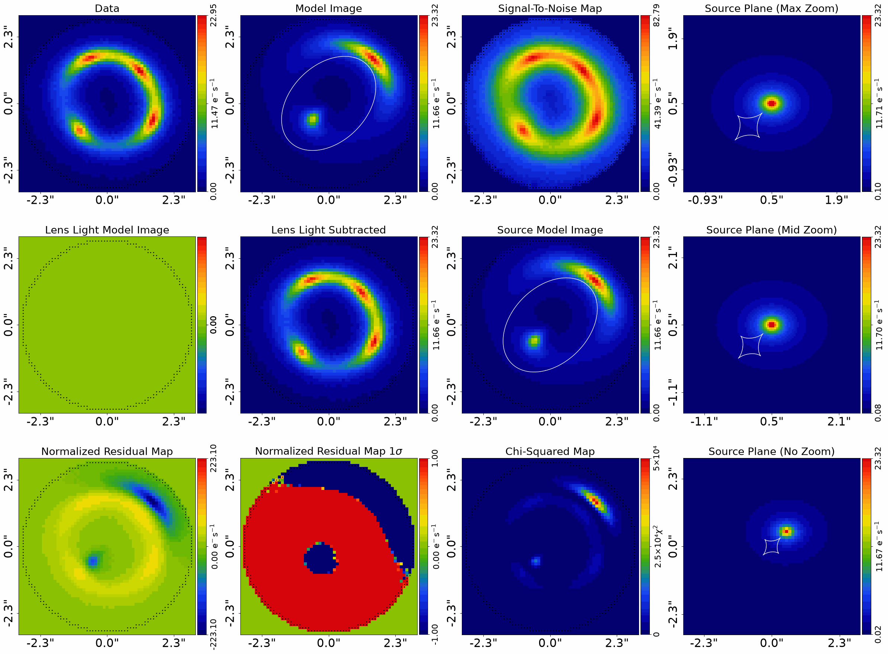
    


It is now evident that this model provides a terrible fit to the data. The tracer does not resemble a plausible
representation of our simulated strong lens dataset, which we already anticipated given that we generated the data ourselves!

As expected, the log likelihood has dropped dramatically with this poorly fitting model.


```python
print("Previous Likelihoods:")
print(fit.log_likelihood)
print(fit_bad.log_likelihood)
print("New Likelihood:")
print(fit_very_bad.log_likelihood)
```

    Previous Likelihoods:
    2899.9134097245014
    -64618.8911885303
    New Likelihood:
    -1599395.1803587012


__Model Fitting__

In the previous sections, we used the true model to fit the data, which resulted in a high log likelihood and minimal 
residuals. We also demonstrated how even small deviations from the true parameters can significantly degrade the fit 
quality, reducing the log likelihood.

In practice, however, we don't know the "true" model. For example, we might have an image of a strong lens observed with 
the Hubble Space Telescope, but the values for parameters like its `einstein_radius` and others are 
unknown. The process of determining the best-fit model is called model fitting, and it is the main topic of
Chapter 2 of **HowToLens**.

To conclude this section, let's perform a basic, hands-on model fit to develop some intuition about how we can find 
the best-fit model. We'll start by loading a simple dataset that was simulated without any lens light, using 
an `IsothermalSph` lens  mass profile and `ExponentialCoreSph` source light profile, but the true parameters of these 
profiles are unknown.


```python
dataset_name = "simple__no_lens_light__mass_sis"
dataset_path = Path("dataset") / "imaging" / dataset_name

if al.util.dataset.should_simulate(str(dataset_path)):
    import subprocess
    import sys

    subprocess.run(
        [sys.executable, "scripts/simulator/no_lens_light__mass_sis.py"],
        check=True,
    )

dataset = al.Imaging.from_fits(
    data_path=dataset_path / "data.fits",
    psf_path=dataset_path / "psf.fits",
    noise_map_path=dataset_path / "noise_map.fits",
    pixel_scales=0.1,
)

mask = al.Mask2D.circular(
    shape_native=dataset.shape_native,
    pixel_scales=dataset.pixel_scales,
    radius=3.0,
)

dataset = dataset.apply_mask(mask=mask)

aplt.subplot_imaging_dataset(dataset=dataset)
```

    Figure(700x700)
    .../PyAutoArray/autoarray/operators/convolver.py:1424: UserWarning: No blurring_image provided. Only the direct image will be convolved. This may change the correctness of the PSF convolution.
      warnings.warn(
    Figure(1800x1800)
    Figure(1800x1800)
    Figure(700x700)
    2026-08-06 13:38:03,369 - autoarray.dataset.imaging.dataset - INFO - IMAGING - Data masked, contains a total of 2828 image-pixels


    
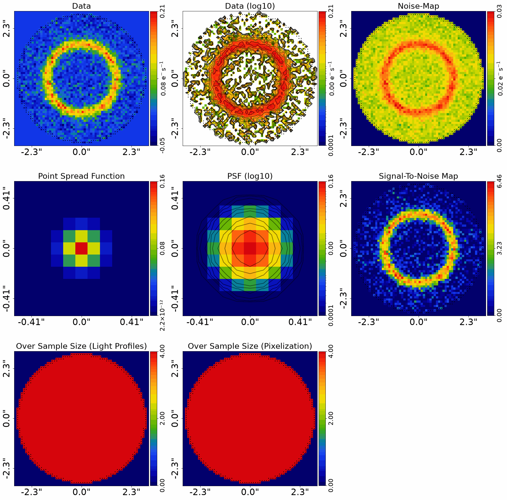
    


Now, you'll try to determine the best-fit model for this image, corresponding to the parameters used to simulate the 
dataset.

We'll use the simplest possible approach: try different combinations of light and mass profile parameters and adjust 
them based on how well each model fits the data. You’ll quickly find that certain parameters produce a much better fit 
than others. For example, determining the correct values of the `centre` should not take too long.

Pay attention to the `log_likelihood` and the `residual_map` as you adjust the parameters. These will guide you in 
determining if your model is providing a good fit to the data. Aim to increase the log likelihood and reduce the 
residuals.

Keep experimenting with different values for a while, seeing how small you can make the residuals and how high you 
can push the log likelihood. Eventually, you’ll likely reach a point where further improvements become difficult, 
even after trying many different parameter values. This is a good point to stop and reflect on your first experience 
with model fitting.


```python

lens_galaxy = al.Galaxy(
    redshift=0.5,
    mass=al.mp.IsothermalSph(
        centre=(1.0, 1.0), einstein_radius=1.0
    ),  # These are the lens parameters you need to adjust
)

source_galaxy = al.Galaxy(
    redshift=1.0,
    bulge=al.lp.ExponentialCoreSph(
        centre=(1.0, 1.0),
        intensity=1.0,
        effective_radius=1.0,
        radius_break=0.025,  # These are the source parameters you need to adjust
    ),
)

tracer = al.Tracer(galaxies=[lens_galaxy, source_galaxy])

fit = al.FitImaging(dataset=dataset, tracer=tracer)

aplt.subplot_fit_imaging(fit=fit)

print("Log Likelihood:")
print(fit.log_likelihood)

```


    
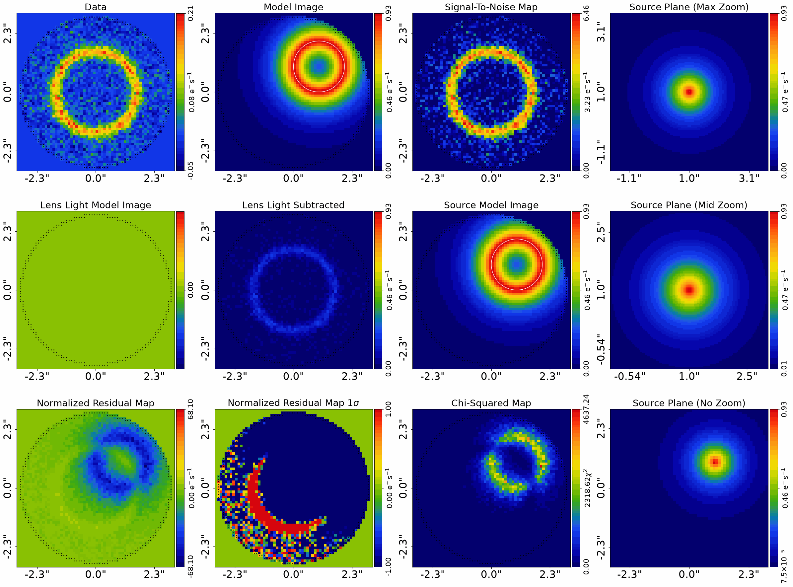
    


    Log Likelihood:
    -468816.25824381993


Manually guessing model parameters repeatedly is a very inefficient and slow way to find the best fit. If the model 
were more complex—say, if the source galaxy had additional light profile components beyond just its `bulge` (like a 
second `Sersic` profile representing a `disk`)—the model would become so intricate that this manual approach 
would be practically impossible. This is definitely not how model fitting is done in practice.

However, this exercise has given you a basic intuition for how model fitting works. The statistical inference tools 
that are actually used for model fitting will be introduced in Chapter 2. Interestingly, these tools are not entirely 
different from the approach you just tried. Essentially, they also involve iteratively testing models until those 
with high log likelihoods are found. The key difference is that a computer can perform this process thousands of 
times, and it does so in a much more efficient and strategic way.

__Wrap Up__

In this tutorial, you have learned how to fit a lens model to imaging data, a fundamental process in astronomy
and statistical inference. 

Let's summarise what we have covered:

- **Dataset**: We loaded the imaging dataset that we previously simulated, consisting of the tracer image, noise map,
  and PSF.
  
- **Mask**: We applied a circular mask to the data, excluding regions with low signal-to-noise ratios from the analysis.

- **Masked Grid**: We created a masked grid, which contains only the coordinates of unmasked pixels, to evaluate the
  tracer's light profile.
  
- **Fitting**: We fitted the data with a lens model, computing key quantities like the model image, residuals,
  chi-squared, and log likelihood to assess the quality of the fit.
  
- **Bad Fits**: We demonstrated how even small deviations from the true parameters can significantly impact the fit
  quality, leading to decreased log likelihood values.
  
- **Model Fitting**: We performed a basic model fit on a simple dataset, adjusting the model parameters to improve the
  fit quality.  
