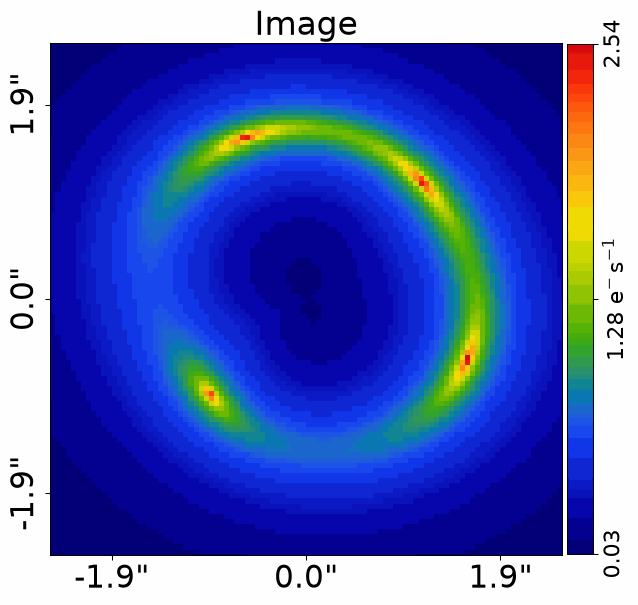
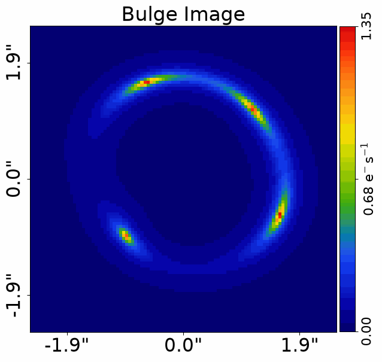
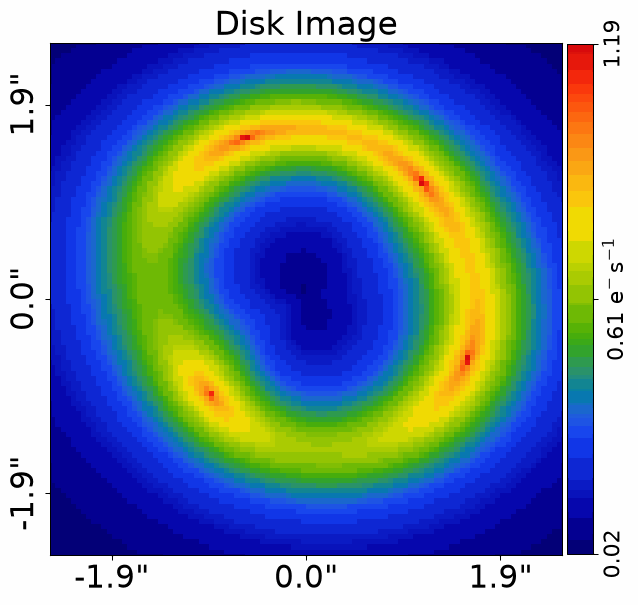
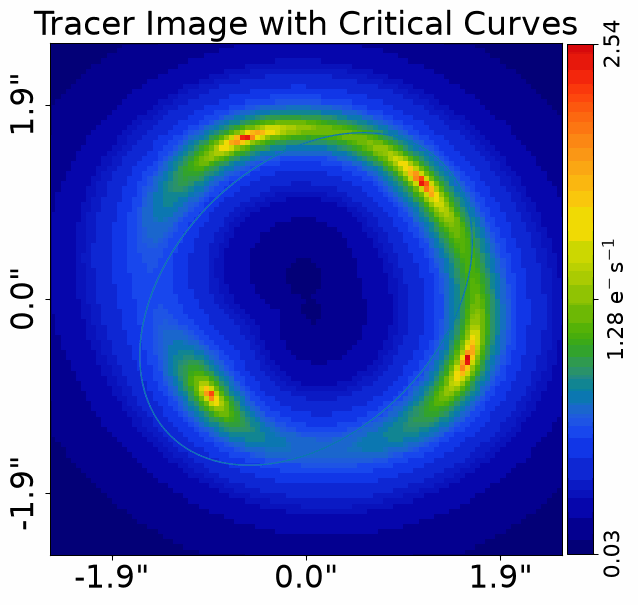

> ✏️ **This page is auto-generated from [`scripts/chapter_1_introduction/tutorial_8_summary.py`](../../scripts/chapter_1_introduction/tutorial_8_summary.py) — do not edit it directly.**
> It shows the example fully executed, with its real output images.
> Run it yourself via the [Python script](../../scripts/chapter_1_introduction/tutorial_8_summary.py) or the [Jupyter notebook](../../notebooks/chapter_1_introduction/tutorial_8_summary.ipynb).

Tutorial 8: Summary
===================

In this chapter, we have learnt that:

 1) **PyAutoLens** uses Cartesian `Grid2D`'s of $(y,x)$ coordinates to perform ray-tracing.
 2) These grids are combined with light and mass profiles to compute images, deflection angles and other quantities.
 3) Profiles are grouped together to make galaxies.
 4) Collections of galaxies (at the same redshift) form a plane.
 5) A `Tracer` can make an image-plane + source-plane strong lens system.
 6) The Universe's cosmology can be input into this `Tracer` to convert its units to kiloparsecs.
 7) The tracer's image can be used to simulate strong lens `Imaging` like it was observed with a real telescope.
 8) This data can be fitted, so to as quantify how well a model strong lens system represents the observed image.

In this summary, we'll go over all the different Python objects introduced throughout this chapter and consider how
they come together as one.

__Contents__

- **Start:** Below, we do all the steps we have learned this chapter, making profiles, galaxies, a tracer, etc.
- **Object Composition:** Lets now consider how all of the objects we've covered throughout this chapter (`LightProfile`'s.
- **Visualization:** Furthermore, using the `MatPLot2D` and `lines=`/`positions=` overlays objects we can visualize any.
- **Code Design:** To end, I want to quickly talk about the **PyAutoLens** code-design and structure, which was really.
- **Source Code:** If you do enjoy code, variables, functions, and parameters, you may want to dig deeper into the.
- **Wrap Up:** Summary of the script and next steps.


```python

from autolens import jax_wrapper  # Sets JAX environment before other imports

# from autolens import setup_notebook; setup_notebook()

from pathlib import Path
import autolens as al
import autolens.plot as aplt
```

    .../PyAutoNerves/autonerves/workspace.py:206: UserWarning: Cannot verify the workspace at HowToLens/scripts/chapter_1_introduction is compatible with the installed library version (2026.7.23.1): no `version.minimum_library_version` or `version.workspace_version` key in config/general.yaml and no version.txt at the workspace root.
    
    If you cloned the workspace from `main` rather than a release tag, set `version.workspace_version_check: False` in config/general.yaml to silence this warning. The `main` branch updates more frequently than library releases, so version mismatches are expected and not actionable for `main`-branch users.
    
    You can also set the environment variable PYAUTO_SKIP_WORKSPACE_VERSION_CHECK=1 to disable temporarily.
      warnings.warn(_missing_version_warning(root, library_version))
    .../PyAutoNerves/autonerves/workspace.py:206: UserWarning: Cannot verify the workspace at HowToLens/scripts/chapter_1_introduction is compatible with the installed library version (2026.7.23.1): no `version.minimum_library_version` or `version.workspace_version` key in config/general.yaml and no version.txt at the workspace root.
    
    If you cloned the workspace from `main` rather than a release tag, set `version.workspace_version_check: False` in config/general.yaml to silence this warning. The `main` branch updates more frequently than library releases, so version mismatches are expected and not actionable for `main`-branch users.
    
    You can also set the environment variable PYAUTO_SKIP_WORKSPACE_VERSION_CHECK=1 to disable temporarily.
      warnings.warn(_missing_version_warning(root, library_version))
    .../PyAutoNerves/autonerves/workspace.py:206: UserWarning: Cannot verify the workspace at HowToLens/scripts/chapter_1_introduction is compatible with the installed library version (2026.7.23.1): no `version.minimum_library_version` or `version.workspace_version` key in config/general.yaml and no version.txt at the workspace root.
    
    If you cloned the workspace from `main` rather than a release tag, set `version.workspace_version_check: False` in config/general.yaml to silence this warning. The `main` branch updates more frequently than library releases, so version mismatches are expected and not actionable for `main`-branch users.
    
    You can also set the environment variable PYAUTO_SKIP_WORKSPACE_VERSION_CHECK=1 to disable temporarily.
      warnings.warn(_missing_version_warning(root, library_version))


__Start__

Below, we do all the steps we have learned this chapter, making profiles, galaxies, a tracer, etc. 

Note that in this tutorial, we omit the lens galaxy's light and include two light profiles in the source representing a
`bulge` and `disk`.


```python
grid = al.Grid2D.uniform(shape_native=(100, 100), pixel_scales=0.05)

lens = al.Galaxy(
    redshift=0.5,
    mass=al.mp.Isothermal(
        centre=(0.0, 0.0), einstein_radius=1.6, ell_comps=(0.17647, 0.0)
    ),
)

source = al.Galaxy(
    redshift=1.0,
    bulge=al.lp.SersicCore(
        centre=(0.1, 0.1),
        ell_comps=(0.0, 0.111111),
        intensity=1.0,
        effective_radius=1.0,
        sersic_index=4.0,
    ),
    disk=al.lp.SersicCore(
        centre=(0.1, 0.1),
        ell_comps=(0.0, 0.111111),
        intensity=1.0,
        effective_radius=1.0,
        sersic_index=1.0,
    ),
)

tracer = al.Tracer(galaxies=[lens, source])
```

__Object Composition__

Lets now consider how all of the objects we've covered throughout this chapter (`LightProfile`'s, `MassProfile`'s,
`Galaxy`'s, `Plane`'s, `Tracer`'s) come together.

The `Tracer`, which contains planes of `Galaxies`, which contains the `Galaxy`'s which contains the `Profile`'s:


```python
print(tracer)
print()
print(tracer.planes[0])
print()
print(tracer.planes[1])
print()
print(tracer.planes[0])
print()
print(tracer.planes[1])
print()
print(tracer.planes[0][0].mass)
print()
print(tracer.planes[1][0].bulge)
print()
print(tracer.planes[1][0].disk)
print()
```

    <autolens.lens.tracer.Tracer object at 0x7f7d381977d0>
    
    [Redshift: 0.5
    Mass Profiles:
    Isothermal
    centre: (0.0, 0.0)
    ell_comps: (0.17647, 0.0)
    einstein_radius: 1.6
    slope: 2.0
    core_radius: 0.0]
    ... [60 lines of output truncated] ...
    centre: (0.1, 0.1)
    ell_comps: (0.0, 0.111111)
    intensity: 1.0
    effective_radius: 1.0
    sersic_index: 4.0
    radius_break: 0.025
    alpha: 3.0
    gamma: 0.25
    
    SersicCore
    centre: (0.1, 0.1)
    ell_comps: (0.0, 0.111111)
    intensity: 1.0
    effective_radius: 1.0
    sersic_index: 1.0
    radius_break: 0.025
    alpha: 3.0
    gamma: 0.25
    


Once we have a tracer we can therefore use any of the plotting function objects throughout this chapter to plot
any specific aspect, whether it be a profile, galaxy, galaxies or tracer. 

For example, if we want to plot the image of the source galaxy's bulge and disk, we can do this in a variety of 
different ways.


```python
aplt.plot_array(array=tracer.image_2d_from(grid=grid), title="Image")

source_plane_grid = tracer.traced_grid_2d_list_from(grid=grid)[1]

```


    

    


Understanding how these objects decompose into the different components of a strong lens is important for general 
**PyAutoLens** use.

As the strong lens systems that we analyse become more complex, it is useful to know how to decompose their light 
profiles, mass profiles, galaxies and planes to extract different pieces of information about the strong lens. For 
example, we made our source-galaxy above with two light profiles, a `bulge` and `disk`. We can plot the lensed image of 
each component individually, now that we know how to break-up the different components of the tracer.


```python
aplt.plot_array(
    array=tracer.planes[1][0].bulge.image_2d_from(grid=source_plane_grid),
    title="Bulge Image",
)

aplt.plot_array(
    array=tracer.planes[1][0].disk.image_2d_from(grid=source_plane_grid),
    title="Disk Image",
)
```


    

    


    

    


__Visualization__

Furthermore, using the `MatPLot2D` and `lines=`/`positions=` overlays objects we can visualize any aspect we're interested 
in and fully customize the figure. 

Before beginning chapter 2 of **HowToLens**, you should checkout the package `autolens_workspace/plot`. This provides a 
full API reference of every plotting option in **PyAutoLens**, allowing you to create your own fully customized 
figures of strong lenses with minimal effort!


```python

tangential_critical_curve_list = al.LensCalc.from_tracer(
    tracer=tracer
).tangential_critical_curve_list_from(grid=grid)
radial_critical_curve_list = al.LensCalc.from_tracer(
    tracer=tracer
).radial_critical_curve_list_from(grid=grid)


aplt.plot_array(
    array=tracer.image_2d_from(grid=grid),
    title="Tracer Image with Critical Curves",
    lines=tangential_critical_curve_list,
)
```


    

    


And, we're done, not just with the tutorial, but the chapter!

__Code Design__

To end, I want to quickly talk about the **PyAutoLens** code-design and structure, which was really the main topic of
this tutorial.

Throughout this chapter, we never talk about anything like it was code. We didn`t refer to  'variables', 'parameters`' 
'functions' or 'dictionaries', did we? Instead, we talked about 'galaxies', 'planes' a 'Tracer', etc. We discussed 
the objects that we, as scientists, think about when we consider a strong lens system.

Software that abstracts the underlying code in this way follows an `object-oriented design`, and it is our hope 
with **PyAutoLens** that we've made its interface (often called the API for short) very intuitive, whether you were
previous familiar with gravitational lensing or a complete newcomer!

__Source Code__

If you do enjoy code, variables, functions, and parameters, you may want to dig deeper into the **PyAutoLens** source 
code at some point in the future. Firstly, you should note that all of the code we discuss throughout the **HowToLens** 
lectures is not contained in just one project (e.g. the **PyAutoLens** GitHub repository) but in fact four repositories:

**PyAutoFit** - Everything required for lens modeling (the topic of chapter 2): https://github.com/PyAutoLabs/PyAutoFit

**PyAutoArray** - Handles all data structures and Astronomy dataset objects: https://github.com/PyAutoLabs/PyAutoArray

**PyAutoGalaxy** - Contains the light profiles, mass profiles and galaxies: https://github.com/PyAutoLabs/PyAutoGalaxy

**PyAutoLens** - Everything strong lensing: https://github.com/PyAutoLabs/PyAutoLens

Instructions on how to build these projects from source are provided here:

https://pyautolens.readthedocs.io/en/latest/installation/source.html

We take a lot of pride in our source code, so I can promise you its well written, well documented and thoroughly 
tested (check out the `test` directory if you're curious how to test code well!).

__Wrap Up__

You`ve learn a lot in this chapter, but what you have not learnt is how to 'model' a real strong gravitational lens.

In the real world, we have no idea what the 'correct' combination of light profiles, mass profiles and galaxies are 
that will give a good fit to a lens. Lens modeling is the process of finding the lens model which provides a good fit 
and it is the topic of chapter 2 of **HowToLens**.

Finally, if you enjoyed doing the **HowToLens** tutorials please git us a star on the **PyAutoLens** GitHub
repository: 

 https://github.com/PyAutoLabs/PyAutoLens

Even the smallest bit of exposure via a GitHub star can help our project grow!
